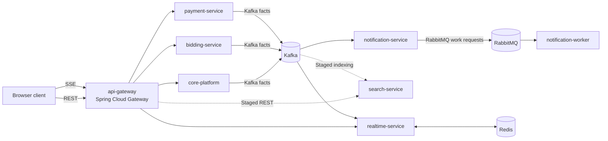

# Architecture overview

Status: Superseded by [design-system 2.0](../2.0/README.md)
Last validated: 2026-08-01

This is the canonical target topology for BidPoint. It names future deployables and their contracts; the discovery repository contains no implemented applications or infrastructure.

## Deployable topology

| Deployable | Canonical responsibility | Explicit non-responsibility |
| --- | --- | --- |
| `api-gateway` | Spring Cloud Gateway Server WebFlux; public API routing, CORS, request/correlation IDs, trace propagation, early JWT rejection, and Redis-backed rate limits. | Business authorization, identity storage, and domain data. |
| `core-platform` | Spring Modulith modular monolith containing `profiles`, `catalog`, `listings`, `auctions`, and `orders`. | Authoritative bids, payment charging, provider delivery, or full-text indexing. |
| `bidding-service` | Authoritative bid state, acceptance, per-auction concurrency/ordering/idempotency, local auction-state projection, and bid outbox. | Auction scheduling and lifecycle authority. |
| `payment-service` | Payment state, provider integration, verified webhooks, idempotency, retries, audit, and payment outbox. | Card-data storage or order ownership. |
| `realtime-service` | Consume Kafka facts, write and fan out through Redis, serve SSE from all replicas, bounded replay/reconnect, and refetch signaling after a replay gap. | Authoritative auction or bid state. |
| `notification-service` | Consume Kafka business facts, apply notification policy, record intent plus a PostgreSQL job outbox, and publish explicit RabbitMQ work requests. | Calling delivery providers directly. |
| `notification-worker` | Consume RabbitMQ jobs, call delivery providers, record attempts, classify retryability, enforce idempotency, and route terminal failures to a DLQ. | Deciding which business facts merit notification. |
| `search-service` | **Staged:** own OpenSearch indexing and expose full-text REST query. | Authoritative listing data or day-one browse/filter. |

## Platform roles

- PostgreSQL stores authoritative business state, owner-local outboxes, inbox/deduplication records, and delivery audit where applicable.
- Redis is acceleration and ephemeral coordination: gateway rate limits and realtime fan-out/bounded replay. It is not an authoritative business database.
- S3 stores listing image objects; `listings` owns their marketplace metadata and lifecycle.
- Kafka carries durable, replayable business facts.
- RabbitMQ carries targeted work requests to competing consumers.
- OpenSearch is a **Staged** derived search store owned by `search-service`.

## Communication map



Browser and other public synchronous calls use REST through Spring Cloud Gateway. Internal synchronous calls use REST through Kubernetes Services and DNS. Kubernetes-native service discovery is sufficient: there is no Eureka and no Spring Cloud Kubernetes discovery server. The only reactive gateway is `api-gateway`; ordinary services use Spring MVC, while the future SSE implementation uses the Spring streaming model selected during implementation.

Browser live updates use SSE, not WebSockets by default. Kafka and RabbitMQ are not interchangeable: a durable fact may have multiple independent consumers and must be replayable, while a work request targets a competing worker pool for one delivery obligation.

## Front doors

### Local

```text
client -> external pinned Traefik -> Spring Cloud Gateway -> Kubernetes Service -> backend
```

Traefik is the local cluster edge and remains external/pinned. Spring Cloud Gateway is the application gateway and owns the application routing concerns listed above.

### AWS

```text
Route 53 DNS -> AWS WAF -> ALB (via AWS Load Balancer Controller) -> Spring Cloud Gateway -> Kubernetes Service -> backend
```

Keycloak has a distinct authentication host or path and is not routed through Spring Cloud Gateway. Kubernetes Gateway API is a configuration API, not BidPoint's runtime application gateway. **Excluded:** AWS API Gateway.

## End-to-end ownership and failure points

| Flow | Owner sequence | Important failure and recovery points |
| --- | --- | --- |
| Bid | client -> `api-gateway` -> `bidding-service` -> bid database/outbox -> Kafka | A timeout after commit is resolved by the idempotency key. Concurrency conflicts cannot weaken bid invariants. A relay outage leaves a committed outbox row for later publication. |
| Auction close and order | `auctions` commits `CLOSING` -> idempotent Bidding REST fence/finalize acknowledgement with stable final outcome (not an order trigger) -> `auctions` atomically commits `CLOSED` plus one producer-owned `AuctionClosed` through the durable Spring Modulith event-publication/outbox mechanism -> `orders` consumes after commit and creates one order when applicable | `AuctionClosed` carries winner/no-winner, final price, lifecycle version, and stable identity. `orders` deduplicates by event/auction identity. The same fact may be externalized to Kafka with the same identity; a bidding-owned final-outcome fact is audit/projection input only. Timeout leaves Core in `CLOSING`; cancellation commits `CANCELLED` without an order trigger. |
| Payment and webhook | order/client action -> `payment-service` -> provider -> verified provider webhook -> payment database/outbox -> Kafka | Stable intent and provider IDs prevent double charge. Unknown or invalid signatures are rejected. Ambiguous provider timeouts are reconciled before retry. |
| Realtime | owner outbox -> Kafka -> `realtime-service` -> Redis -> SSE replicas -> browser | Consumer lag may delay display. Reconnect uses bounded replay; a gap instructs the client to refetch authoritative REST state. |
| Notification | Kafka fact -> `notification-service` policy/intent/job outbox -> RabbitMQ -> `notification-worker` -> provider | Both fact and work can redeliver. Provider selection requires idempotency and reconciliation by stable delivery key. A crash/timeout after a provider may have accepted delivery is recorded `UNKNOWN` and quarantined without automatic replay until reconciliation establishes the provider outcome. |

## Staged, open, and excluded decisions

**Staged:** `search-service`/OpenSearch; Istio ambient service identity, mTLS, authorization policies, and fault injection.

**Open:** payment provider, notification delivery provider, frontend libraries, Kafka/MSK mode, schema registry, public license.

**Excluded:** Spring Cloud Stream, Eureka, AWS API Gateway, WebSockets by default, and unnecessary CRUD microservices.
