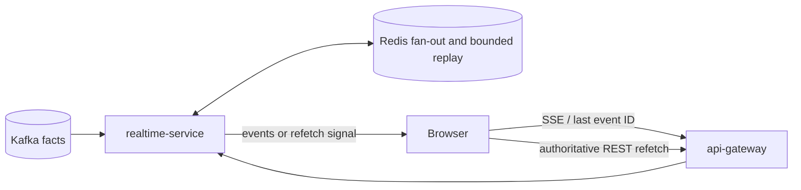

# REST, SSE, and service communication

Status: Superseded by [design-system 2.0](../2.0/README.md)
Last validated: 2026-08-01

This is the target communication contract for BidPoint, not a record of implemented endpoints. Protocol choice follows the needed delivery semantics: REST for request/response behavior, SSE for browser live updates, Kafka for durable replayable facts, and RabbitMQ for targeted work.

## Synchronous paths and discovery

Browser and other public synchronous calls use REST through `api-gateway`, which is Spring Cloud Gateway Server WebFlux. The gateway routes public APIs, owns CORS, creates/forwards request and correlation IDs, propagates trace context, performs early JWT rejection, and applies Redis-backed rate limits. It does not own business authorization; the backend that owns the resource makes target- and object-level access decisions.

Internal synchronous calls use REST through Kubernetes Services and DNS. Kubernetes-native service discovery is sufficient; the baseline has no Eureka and no Spring Cloud Kubernetes discovery server. Timeouts, response size, retry eligibility, and fallback behavior are per-client contract decisions. A client retries a command only where a stable idempotency key makes it safe; it does not convert an ambiguous write timeout into an unbounded new request.

| Caller type | Route | Contract |
| --- | --- | --- |
| Browser/public client | REST -> `api-gateway` -> Kubernetes Service -> owner | Authentication, coarse edge controls, authoritative command/read response |
| Backend needing current owned state | REST -> Kubernetes Service/DNS -> owner | Bounded timeout; owner API remains authoritative |
| Backend tolerating lag | Kafka fact -> owner-local projection | Explicit freshness/lag behavior; no foreign write authority |
| Browser awaiting live changes | SSE -> `api-gateway` -> `realtime-service` | Ordered per-stream notifications with bounded replay/refetch |

Ordinary backend services use familiar Spring MVC packages and request/response handling. The reactive exception is the WebFlux gateway. The future SSE implementation may select a Spring streaming model during implementation; it must not turn WebSockets into the default without a separate decision.

## Explicit front doors

Local traffic follows:

```text
client -> external pinned Traefik -> Spring Cloud Gateway -> Kubernetes Service -> backend
```

AWS traffic follows:

```text
Route 53 DNS -> AWS WAF -> ALB (via AWS Load Balancer Controller) -> Spring Cloud Gateway -> Kubernetes Service -> backend
```

Traefik is a pinned external local-cluster edge. Spring Cloud Gateway is the runtime application gateway in both environments. Kubernetes Gateway API is a configuration API, not a runtime replacement for Spring Cloud Gateway. Keycloak uses a distinct authentication host or path and is never routed through the application gateway. **Excluded:** AWS API Gateway.

## REST command and error discipline

Owner APIs use explicit resource and command names rather than hiding cross-owner coupling behind a generic gateway. Commands carry a client-generated idempotency key when repeat safety matters, especially bid and payment requests. Responses expose the stable operation/resource identifier and correlation ID so a caller can resolve a timeout through a safe repeat or status read.

Validation and authorization occur at the owner. `bidding-service` accepts or rejects bids against its authoritative state; `payment-service` accepts verified provider webhooks and owns payment actions; Core modules own their exported behavior. Gateway rejection, route policy, and rate limits are early controls, not proof that a backend may trust request-body subject claims or omit authorization.

An API that starts asynchronous owner work returns a durable identifier and an honest processing state. It does not claim that an order, notification, or provider action completed merely because the initial owner transaction committed. Correlation and trace identifiers propagate from public request through internal REST and later event processing where applicable.

Auction close/cancel uses an idempotent Bidding REST fence/finalize command that serializes with bid acceptance and returns a stable acknowledgement/final outcome; that result is not an order trigger. Timeout leaves Core in `CLOSING`. After close acknowledgement, `auctions` atomically commits `CLOSED` and one producer-owned `AuctionClosed` through durable Spring Modulith event publication; `orders` consumes only after commit and deduplicates by event/auction identity. Cancellation commits `CANCELLED` without an order trigger. Bid requests use trusted time and reject at or after `closeAt`.

## SSE contract

`realtime-service` consumes Kafka business facts, writes/fans out via Redis, and serves SSE from every replica. Redis accelerates fan-out and bounded replay; it is not authoritative bid or auction state. Clients reconnect with their last received event ID. If the retained replay window cannot bridge the gap, the service emits a refetch signal and the browser obtains authoritative REST state from the relevant owner.

SSE messages are updates to a view, not bid acceptance. A client never treats an event as authorization to submit a bid or as proof of final state when it has missed replay. Consumer lag, Redis disruption, browser disconnects, duplicate fact delivery, and replica changes are normal failure modes. The service makes them observable and preserves a bounded replay contract, while authoritative command paths remain available through REST.



## Boundary choices

Kafka is not used as a request/reply shortcut: it transports durable replayable facts. RabbitMQ is not a browser-stream substitute: it transports explicit targeted work to competing workers. **Excluded:** Spring Cloud Stream, Eureka, WebSockets by default, and AWS API Gateway. **Staged:** Istio ambient service identity/mTLS, authorization policies, and fault injection; they may add defense in depth later and never replace JWT validation or business authorization.
