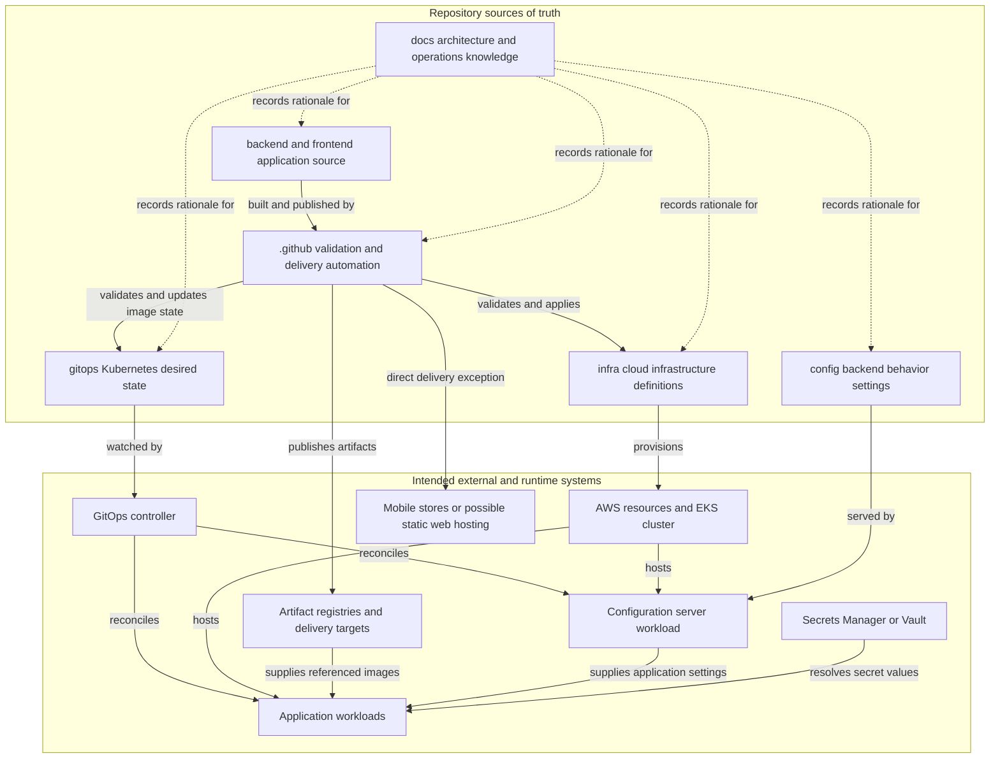

# Ownership and System Boundaries

BidPoint is an organization-level monorepo for one distributed system. It keeps application source, backend runtime configuration, deployment state, cloud infrastructure definitions, repository automation, and durable engineering knowledge together, but it does **not** give those concerns shared ownership. Every committed artifact has exactly one owning module; a pull request may coordinate several owners only when it explains why the change crosses their boundaries.

> **Current status:** these boundaries primarily document intended architecture. The Kubernetes cluster, configuration server, application workloads, backend configuration sets, and product delivery pipelines are not implemented. The repository currently provides boundary READMEs and baseline governance, plus a scheduled OpenWiki documentation workflow. Do not read the diagrams or lifecycle below as evidence that a deployable BidPoint system exists today.

## Two different maps: repository ownership and runtime relationships

Repository ownership answers **where the reviewed declaration belongs**. Runtime relationships answer **which process consumes that declaration and where live state exists**. Conflating the maps is the source of many placement mistakes:

- `infra/` owns a declaration that a cluster should exist; the live cluster exists in AWS, not in Git.
- `gitops/` owns the desired state of software on that cluster; a GitOps controller and Kubernetes hold observed workload state at runtime.
- `config/` owns versioned backend behavior settings; an intended configuration server serves them to backend applications.
- `backend/` and `frontend/` own source; CI is intended to turn source into artifacts held by registries, hosting systems, or mobile distribution systems.
- `docs/` owns durable rationale and procedures, but it is not executable control-plane state.
- Secret-manager resources may be declared by `infra/`, and secret references may be declared by `gitops/`, but secret **values** live only in an external secrets system.

The fact that all declarations are reviewed in one repository makes coordinated changes possible; it does not transfer authority between them.

## Intended composition



*Figure 1. Repository sources of truth and their intended delivery and runtime relationships; the runtime components and most automation shown here are planned rather than deployed.*

The diagram is a composition model, not one synchronous request flow. In particular, infrastructure provisioning, artifact publication, GitOps reconciliation, configuration refresh, and application execution have independent lifecycles.

## Repository owners

### Application source: `backend/` and `frontend/`

[`backend/`](../../backend/README.md) is the source owner for server-side business capabilities: domain logic, authoritative business rules, APIs, persistence and migrations, asynchronous producers and consumers, provider integrations, and shared backend libraries. It does **not** own Kubernetes manifests, cloud infrastructure, environment-specific production values, or credentials. Backend source must consume environment knowledge through explicit configuration interfaces and environment variables, so the source itself cannot determine whether it is running in `dev`, `staging`, or `prod`.

[`frontend/`](../../frontend/README.md) owns user-facing source in independent `web/` and `mobile/` workspaces: UI, client state, assets, client-specific integrations, and each client's non-sensitive settings. A browser endpoint or mobile build profile belongs with that client, not in the backend-only root `config/`. Authoritative rules do not belong solely in a client, deployment and infrastructure declarations do not belong here, and no client bundle may contain secrets. Mobile packaging, signing, and store-release configuration is the narrow exception to the rule against deployment concerns in application modules because it is inseparable from the mobile toolchain; the workflow that executes it remains owned by `.github/`.

The source boundary does not choose a backend service decomposition or web hosting model. Those are still open architecture decisions. See [Application Domains and Client Boundaries](application-domains.md) for the backend, web, and mobile authority model.

### Backend behavior: `config/`

[`config/`](../../config/README.md) owns values whose meaning comes from backend application code: service and messaging endpoints, feature flags, timeouts, retry counts, behavior switches, logging settings, business thresholds, and per-environment variants of those values. For example, `bid.timeout: 30s` belongs here because it has meaning only to a service that implements bidding.

It does not own replicas, memory limits, health probes, Kubernetes objects, infrastructure definitions, frontend settings, application code, or secret values. Settings are intended to be served by a configuration server and read at application startup and on refresh, which allows a behavior change without rebuilding or redeploying the consuming workload. Spring Cloud Config is the expected implementation because the planned backend is Spring Boot, but no configuration sets or server currently exist.

### Kubernetes desired state: `gitops/`

[`gitops/`](../../gitops/README.md) owns the answer to: **given an existing cluster, what software should be running on it?** Its practical artifacts include image versions, replicas, resource requests and limits, Services, ServiceAccounts and workload identities, ingress or gateway exposure, probes, autoscaling, deployment strategies, per-environment sizing, and platform workloads. `replicas: 3` belongs here because Kubernetes understands it even if BidPoint application source is removed.

It does not create the cluster, network, or managed cloud services; contain application logic; or own backend behavior. It may declare references to secrets but never their values. The intended `gitops/apps/` and `gitops/platform/` split would keep BidPoint application workloads separate from observability and other shared cluster software because their owners, upgrade cadences, and blast radii differ. Neither subtree nor any workload manifest exists yet.

### Cloud foundation: `infra/`

[`infra/`](../../infra/README.md) owns Infrastructure as Code for account and environment topology, VPCs and subnets, EKS clusters and node capacity, IAM, ECR repositories, databases, caches, DNS, load balancers, KMS keys, secret-manager resources, storage, connectivity, and cloud-level observability. Terraform or OpenTofu is a likely future mechanism, not a selected implementation present in the repository.

It does not own Kubernetes workload definitions, application behavior, source code, or secret values. Creating a secrets-manager resource is infrastructure; populating a credential into it is an out-of-band secret operation; making a pod refer to it is desired workload state in `gitops/`.

### Automation and governance: `.github/`

[`.github/`](../../.github/AUTOMATION.md) owns workflows and repository policy, not the definitions those workflows act upon. Intended responsibilities include path-aware build and test automation, artifact publication, release workflows, infrastructure validation and apply, GitOps validation, dependency and security automation, and repository templates. An infrastructure workflow may validate and apply `infra/`; that does not make `.github/` the infrastructure source of truth. Likewise, a manifest validator does not own the manifests.

Path scoping is part of the boundary design: a mobile-only change should not run infrastructure validation, and an infrastructure-only change should not rebuild both clients. If one automation job continually needs unrelated module paths to do one task, that is a signal to re-examine the ownership boundary rather than normalize the coupling.

Directory structure alone does not enforce review ownership. `CODEOWNERS` is the enforcement mechanism, while the pull request template asks authors to identify all owning modules, explain cross-module coordination, check for secrets and environment values, and record architectural decisions. At present, `CODEOWNERS` routes all files to one default owner; per-module owners and product CI/CD workflows have not been implemented. The scheduled `openwiki-update.yml` workflow refreshes repository knowledge, but it is not an application build or delivery pipeline.

### Durable knowledge: `docs/`

[`docs/`](../../docs/README.md) owns knowledge that should outlive a branch: system architecture and boundaries, Architecture Decision Records, system diagrams, runbooks, incident procedures, and debugging guidance. A significant choice belongs in `docs/adr/` with its context and rejected alternatives; a superseded ADR is marked rather than deleted so its reasoning remains available.

Module-specific usage belongs in the module's README, generated API reference belongs with its generator or output mechanism, and transient plans belong in the issue or pull request. Documentation explains why the executable owners are shaped as they are; it does not duplicate their manifests or configuration as a second source of truth.

## The critical setting boundary

Format does not determine ownership. Both a backend behavior setting and a Kubernetes control can appear as YAML or as an environment variable. The deciding question is **which process interprets the value**:

| Question | `config/` | `gitops/` |
| --- | --- | --- |
| Consumer | Backend application | Kubernetes |
| Consumption point | Application startup and refresh | Pod creation and reconciliation |
| Examples | Bid extension window, retry count, log level | Replica count, memory limit, probe path |

Two placement tests make ambiguous cases concrete:

1. **Generic or BidPoint-specific?** Controls common to arbitrary Deployments belong to `gitops/`; values meaningful only because BidPoint code reads them belong to `config/`.
2. **Would the value still mean something if backend source disappeared?** A replica count would; a bid timeout would not.

A backend workload manifest may set only the bootstrap and identity variables below, plus variables sourced from Kubernetes Secrets:

```text
SPRING_PROFILES_ACTIVE
SPRING_APPLICATION_NAME
SPRING_CONFIG_IMPORT
```

These tell a service which profile and configuration set to request and where the configuration server is. Any other backend application environment variable in `gitops/` creates two owners. With Spring Boot relaxed binding, names such as `BID_TIMEOUT` and `bid.timeout` can identify the same property, and environment-variable precedence can silently override the value served from `config/`. The reviewed configuration file then appears correct while the running service ignores it.

See [Configuration, Secrets, and Environment Isolation](../concepts/configuration-secrets-and-environments.md) for the detailed placement decision tree.

## Why infrastructure and workloads have different owners

The `infra/` to `gitops/` handoff is deliberately one-way at runtime: infrastructure creates the cluster and foundational services; GitOps assumes that cluster already exists and declares software to run on it.

Infrastructure changes are slow, stateful, potentially expensive, and costly to reverse. Network, IAM, database, or cluster changes can affect many workloads and durable resources at once, so their validation, approval, and apply path should reflect that blast radius. Workload changes—an image version, replica count, probe, or resource limit—are expected to be frequent and routinely reconciled by a controller. Combining the two would force every application deployment through the risk profile and cadence of a foundational infrastructure change; treating infrastructure apply like routine workload reconciliation would create the opposite and more dangerous error.

The boundary also prevents CI from becoming the cluster state owner. The intended delivery contract is:

1. CI builds and publishes an application artifact.
2. Delivery automation commits the desired image version to `gitops/`.
3. A GitOps controller observes that declaration and reconciles the cluster.
4. CI may validate manifests, but it does not issue the cluster deployment directly.

Static web bundles and mobile store releases are the exception because they do not run in the cluster and may be delivered directly by CI. The web hosting model remains undecided; if web becomes a Kubernetes workload, it follows the GitOps path.

## Independent state and lifecycle

A coordinated feature may touch several modules without turning them into one lifecycle:

1. **Reason and ownership:** the pull request identifies each owning module and explains why coordination is necessary. An architectural choice is recorded in an ADR.
2. **Source:** affected application paths are built and tested; published outputs live in external artifact systems such as ECR, not in Git.
3. **Foundation:** if the feature needs a new cloud primitive, an independently reviewed infrastructure change creates it before anything can consume it.
4. **Desired workload state:** `gitops/` references the intended image and declares Kubernetes operating controls. Reconciliation happens only after the cluster exists.
5. **Backend behavior:** `config/` supplies environment-specific application values through the intended configuration server. A refresh may change behavior independently of image publication or workload recreation.
6. **Secrets:** committed definitions contain references only; the runtime resolves values from AWS Secrets Manager or Vault.
7. **Knowledge:** durable rationale and operating procedures are updated without becoming executable state.

Live runtime data does not move back into Git. Container artifacts belong in ECR, static frontend artifacts may belong in S3 or a CDN if that model is selected, secrets remain in a secret manager, application data remains in databases, and telemetry remains in observability platforms. This repository may provision or configure those systems, but it does not own their live data as committed content.

Environment isolation is invariant across these lifecycles. `dev`, `staging`, and `prod` are separate; a behavior, workload, or infrastructure change intended for one must not implicitly alter another.

## Invariants and failure modes

| Invariant | Consequence of violating it |
| --- | --- |
| Every committed artifact has one semantic owner. | Two reviewed declarations can compete, and it becomes unclear which change should take effect. |
| Backend behavior is not duplicated in `gitops/`. | Environment-variable precedence can silently mask configuration-server values. |
| `infra/` creates foundations and `gitops/` reconciles workloads. | Routine releases inherit infrastructure risk, or high-blast-radius infrastructure changes receive release-like controls. |
| CI does not deploy cluster workloads directly. | Git ceases to be the complete desired-state authority and the controller can reconcile against a declaration CI bypassed. |
| Source contains no hardcoded environment knowledge. | One artifact cannot be promoted safely through isolated environments. |
| Secret values never enter Git or client artifacts. | Credentials become permanently exposed or recoverable by end users. |
| Cross-module work explains why coordination is required. | Accidental coupling is hidden inside a convenient monorepo change. |
| Significant decisions have ADRs. | Deliberate architecture becomes indistinguishable from accidental structure. |

## Validation and extension points

There is no product implementation to run or deploy yet, so boundary validation is mostly documentary and review-based today. As each mechanism is introduced, the narrow checks that matter are:

- policy checks that reject plaintext secrets and backend behavior variables in `gitops/` other than the three bootstrap variables and secret-backed values;
- configuration inventories that detect a backend property declared in both `config/` and workload state;
- manifest rendering and schema checks per environment, including tests that a `dev` change does not alter `staging` or `prod` output;
- Infrastructure as Code formatting, validation, policy, and reviewed plans before a separately authorized apply;
- path-filter tests proving a change triggers only its owning build, validation, or delivery workflows;
- artifact-to-GitOps checks proving a published image version is the one referenced by desired state, followed by reconciliation health checks once a controller and cluster exist;
- independent application builds and tests, rather than a repository-wide build that erases workspace ownership;
- governance tests for `CODEOWNERS`, pull request metadata, and required ADR updates when a boundary changes.

Future implementation should extend the declared owners rather than invent a second source of truth. Expected extension points include backend service directories and contracts under the application domain, per-environment sets and the configuration-server integration for `config/`, `apps/` and `platform/` workload trees under `gitops/`, environment topology under `infra/`, and path-aware workflows plus per-module review owners under `.github/`. Technology and topology choices that remain open—backend decomposition, web hosting, Terraform versus OpenTofu, the concrete GitOps controller, and client contract publication—must be decided explicitly before documentation presents them as current architecture.

## Related pages

- [Application Domains and Client Boundaries](application-domains.md)
- [Configuration, Secrets, and Environment Isolation](../concepts/configuration-secrets-and-environments.md)
- [Quickstart](../quickstart.md)
- [Repository Change Lifecycle](../workflows/repository-change-lifecycle.md)
