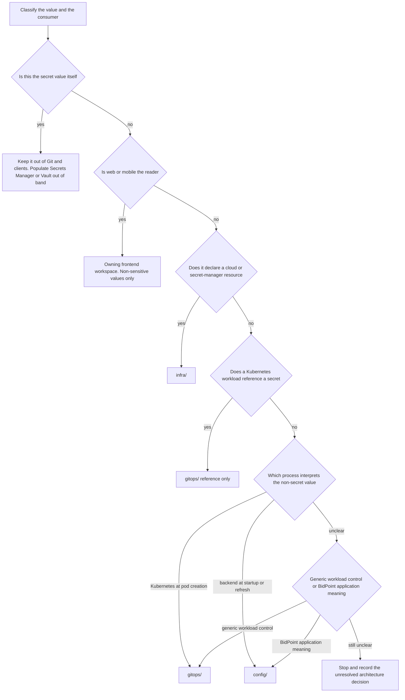

# Configuration, Secrets, and Environment Isolation

BidPoint uses ownership, not file format, to place settings. A YAML key or environment variable does not automatically belong to deployment configuration: the owner is the component that gives the value meaning. Backend behavior belongs to [`config/`](../../config/README.md), Kubernetes workload behavior to [`gitops/`](../../gitops/README.md), cloud foundations to [`infra/`](../../infra/README.md), and non-sensitive client settings to the relevant frontend workspace. Secret values are the exception to repository ownership: they never enter Git.

> **Current status:** these are intended boundaries in an early scaffold. Spring Cloud Config delivery and a configuration-server workload are expected but not implemented. There are no backend configuration sets, no per-environment configuration sets, no configuration server, no Kubernetes workload trees, and no implemented infrastructure. The frontend workspaces also have no concrete toolchains or configuration mechanisms yet. The names `dev`, `staging`, and `prod` establish an isolation requirement, not evidence of existing environment deployments or a chosen account and cluster topology.

## Non-negotiable invariants

1. **One setting, one owner.** A coordinated change may touch several modules, but the same semantic value must not be declared independently in two of them.
2. **No secret value in the repository.** Passwords, tokens, API keys, and credential-bearing connection strings belong in AWS Secrets Manager or Vault and are populated out of band. This applies to every path, including `config/`, `gitops/`, `infra/`, examples, documentation, and automation.
3. **No secret in a client artifact.** Browser output, mobile bundles, and device traffic are inspectable by users. Moving a credential from source code into frontend build or runtime configuration does not make it secret.
4. **Environment knowledge is injected.** Backend source consumes explicit configuration and environment variables; it must not hardcode whether it is running in `dev`, `staging`, or `prod`.
5. **Environment changes are scoped.** A change intended for one of `dev`, `staging`, or `prod` must not implicitly alter either of the others.

These invariants distinguish declarations in Git from live state. Git may declare a secret-manager resource or a workload's reference to a secret, but Git never owns the credential stored in that resource.

## Placement decision

Use the decision flow before choosing a filename or serialization format.



*Figure 1. Setting-placement decision flow; secret values leave the repository path before settings are assigned to a Git-owned module.*

The resulting ownership table is:

| Material | Owner and location | What may be committed |
| --- | --- | --- |
| Backend behavior | `config/` | Non-sensitive service and messaging endpoints, feature flags, timeouts, retries, business thresholds, behavior switches, logging configuration, and eventually environment-specific variants |
| Kubernetes workload behavior | `gitops/` | Image versions, replicas, resource requests and limits, Services, identities, ingress, probes, autoscaling, deployment strategy, platform workloads, and environment-specific workload sizing |
| Frontend behavior | `frontend/web/` or `frontend/mobile/` | Only the owning client's non-sensitive endpoints, feature flags, build profiles, and other client settings |
| Cloud and platform foundation | `infra/` | Infrastructure declarations for accounts and environment topology, networking, clusters, IAM, registries, databases, caches, DNS, KMS keys, and secret-manager resources |
| Workload secret use | `gitops/` | A reference or wiring declaration, including an environment variable sourced from a Kubernetes Secret; never the resolved value |
| Secret value | AWS Secrets Manager or Vault | Nothing in Git; an authorized process places and rotates the value out of band |

### The reader/process test

For a non-sensitive backend value, ask **which process reads and interprets it**:

- If Kubernetes reads it when creating or reconciling a pod, it belongs in `gitops/`. Replicas, memory limits, and health probes remain meaningful to the platform.
- If backend application code reads it at startup or on configuration refresh, it belongs in `config/`. Bid extension windows, retry counts, log levels, and application endpoints affect application behavior.

This is the primary test even when both values ultimately appear in a container environment. Representation is not ownership. A Kubernetes manifest can carry an application environment variable, but doing so does not make Kubernetes the semantic reader of that variable.

### The generic-versus-domain-specific test

When the process test is unclear, ask whether the value is a **generic workload control** or gains meaning from **BidPoint application behavior**:

- A control common to arbitrary Kubernetes Deployments, such as `replicas`, belongs in `gitops/`.
- A concept meaningful because BidPoint code implements it, such as a bid extension window, belongs in `config/`.

A useful equivalent is the deletion test: if all backend application source disappeared, would the value still mean something? `replicas: 3` would; `bid.timeout: 30s` would not. “Generic” here means generic to operating a workload, not merely a feature available in many application frameworks. A log level is still application behavior and therefore belongs in `config/`.

If these tests do not settle ownership, do not hide a new architecture decision in a manifest. Stop, explain the ambiguity, and record the decided boundary in an ADR.

## Backend bootstrap and the duplication trap

A backend workload in `gitops/` has one narrow exception to the application-behavior rule. It may set only this bootstrap and identity allowance:

```text
SPRING_PROFILES_ACTIVE     which environment the service is running as
SPRING_APPLICATION_NAME    which configuration set to request
SPRING_CONFIG_IMPORT       where the configuration server is
+ secret-backed variables sourced from Kubernetes Secrets
```

The first three values let a Spring Boot service identify its environment and application and locate the expected configuration server before it can request behavior settings. The last category lets the workload reference credentials without putting their values in Git. It does not permit a plaintext value, and it does not transfer ownership of the secret value to `gitops/`.

Any other backend application environment variable in a workload manifest duplicates `config/` ownership. Spring Boot relaxed binding can treat spellings such as `BID_TIMEOUT` and `bid.timeout` as the same property. Environment-variable property sources can outrank a value delivered by the configuration server, so the duplicate may silently win: the reviewed file under `config/` looks correct while the running service ignores it. Validation therefore needs to compare canonical property identities, not only exact strings.

The intended delivery model is that a configuration server serves `config/` and backend services read settings at startup and on refresh. Spring Cloud Config is the expected implementation because the backend is expected to use Spring Boot. This would allow a behavior value to change without rebuilding or redeploying its consumer. It is an expected design only: no configuration sets—per-environment or otherwise—exist, and no configuration-server workload is deployed.

## Secret ownership and lifecycle

Treat a secret-related change as three separate artifacts with different owners:

1. **Resource declaration:** `infra/` creates the KMS keys and secret-manager resources as cloud infrastructure. It must not include the password, token, key, or credential-bearing connection string.
2. **Value population:** an authorized out-of-band process places or rotates the value in AWS Secrets Manager or Vault. The repository neither stores nor versions it.
3. **Consumer reference:** `gitops/` declares only how a workload refers to the secret, including variables sourced from Kubernetes Secrets. The live value is resolved from the external secret-management system at runtime.

The repository does not yet choose or implement the synchronization mechanism between the external secret manager, Kubernetes Secrets, and workloads. Do not infer an External Secrets operator, CSI driver, rotation procedure, or restart and refresh behavior. Those choices require an implementation and, where architectural, an ADR. Until then, a reference proves only intended wiring; it does not prove that a value exists or that rotation reaches a running process.

The root [`.gitignore`](../../.gitignore) ignores `.env` and `.env.*` while allowing `.env.example` to be tracked. That is a convenience against common accidental commits, not permission to place secrets in an example and not a complete secret control: credentials can appear under any filename and can remain in Git history after deletion. An example file may contain names, documentation, and inert placeholders only.

## Frontend settings are public settings

The root `config/` module is backend-only. Web and mobile do not consume it and do not share a frontend root build system. Each client owns its settings inside its independent workspace:

- [`frontend/web/`](../../frontend/web/README.md) owns non-sensitive browser endpoints and feature flags. Delivery may eventually be build-time or runtime, because the web hosting model is undecided; neither mode can carry a secret.
- [`frontend/mobile/`](../../frontend/mobile/README.md) owns non-sensitive endpoints, feature flags, and build profiles. Build-time and remotely delivered values must remain non-sensitive because users can inspect bundles and device traffic. Mobile signing and release configuration belongs with the mobile toolchain, but sensitive signing material still must not be committed.

A frontend cannot safely call a third-party API that requires embedding a shared secret. That need changes the system boundary—typically by requiring an authoritative backend integration—rather than creating an exception to client secret safety.

## Environment isolation

`dev`, `staging`, and `prod` are separate targets. Isolation applies independently at every ownership layer; it is not achieved merely by setting `SPRING_PROFILES_ACTIVE`.

| Layer | Environment-owned concern | Isolation rule and present status |
| --- | --- | --- |
| `config/` | Backend behavior values | Future environment-specific values remain separate and are selected by bootstrap identity. No configuration sets exist yet. |
| `gitops/` | Workload sizing, image state, exposure, scaling, bootstrap identity, and secret references | A change for one target must not alter another target's rendered desired state. The intended workload trees do not exist yet. |
| `infra/` | Account and environment topology, networks, clusters, data services, KMS, and secret-manager resources | Foundational changes need independently reviewed plans. Concrete environment topology and Infrastructure as Code are not implemented. |
| Frontend workspace | Non-sensitive client endpoints, flags, and mobile build profiles | A target-specific client build must select only that target's public settings. Concrete build systems are not implemented. |
| External secret system | Live credentials | Values must be independently scoped by the eventual operational design and populated out of band. The repository does not define the namespace, account, or rotation topology yet. |

Keep **ownership** stable while varying **values**. A production retry count does not move to `gitops/` because it differs from development; it remains backend behavior in `config/`. A production replica count remains in `gitops/`. A production database resource remains in `infra/`. Likewise, do not hardcode target selection in backend source: the same artifact should receive environment knowledge at runtime.

For a change scoped to one environment:

1. Name the target explicitly in the pull request and identify every owning module touched.
2. Change only that target's declaration or external value; do not mutate a shared base unless all consuming environments are intentionally in scope.
3. Review the rendered or planned output for all three targets, not only the intended one, so unchanged targets are proven unchanged.
4. Coordinate prerequisite resources, secret population, references, and configuration without copying one value into multiple owners.
5. Promote only after the target-specific checks pass. No repository pipeline currently implements this sequence.

## Safe change procedure

1. **Classify sensitivity first.** If the material is a secret value, stop before editing and use the out-of-band secret process. If a frontend needs it, redesign the boundary rather than shipping it.
2. **Identify the semantic reader.** Use the reader/process test, then the generic-versus-domain-specific and deletion tests for ambiguity.
3. **Choose exactly one owner.** Search the relevant current declarations for an existing semantic equivalent, accounting for Spring relaxed binding when backend properties are involved.
4. **Scope the environment.** State whether the change affects `dev`, `staging`, `prod`, or intentionally all three. Avoid shared edits with accidental cross-environment impact.
5. **Separate resource, value, and reference.** A coordinated secret change may require `infra/`, an out-of-band operation, and `gitops/`, but none may duplicate the others' artifact.
6. **Explain cross-module coordination.** The pull request template requires the changed owners and reason, checks that no secret or environment-specific value was committed, and asks for an ADR when the boundary itself changes.
7. **Run the narrow validation for each owner.** Do not treat a successful application build as proof that Kubernetes, infrastructure, secret resolution, or another environment is correct.

## Validation and failure modes

Current enforcement is limited. The root ignore rules and pull request checklist provide useful guardrails, but concrete product CI, per-module ownership rules, configuration validation, infrastructure validation, and GitOps validation are not implemented. Review must therefore enforce these boundaries today.

| Failure | Why it can evade review | Focused check |
| --- | --- | --- |
| Plaintext secret enters Git | Ignore rules cover common `.env` names, not arbitrary files or history | Secret-scan the complete diff and generated artifacts; block real values even in examples |
| Secret enters a frontend | Build variables can look private before bundling | Inspect browser and mobile outputs and test that all shipped configuration is public |
| Backend behavior is declared in `gitops/` | It looks like ordinary container configuration | Allow only the three bootstrap names and variables sourced from Kubernetes Secrets |
| The same Spring property has two spellings | Relaxed binding hides textual differences | Canonicalize property names and compare `config/` with workload environment variables |
| One environment change affects another | Shared bases and broad selectors enlarge the diff implicitly | Render or plan `dev`, `staging`, and `prod` separately and assert non-target outputs are unchanged |
| A secret reference has no usable value | Git contains the reference but not external live state | Validate reference existence and authorized runtime resolution without printing the value |
| Infrastructure embeds a secret payload | A resource declaration and resource contents can be confused | Inspect policy and plan output for resource creation only and protect plan logs from sensitive output |
| Backend source hardcodes an environment | Unit tests may pass for the author's target | Build one artifact and exercise it with injected target configuration rather than source changes |

As implementation arrives, add these checks at the narrowest boundary that can prove them: schema and semantic checks for future configuration sets; a GitOps environment-variable allowlist; duplicate-property detection using Spring's canonical naming; per-environment manifest rendering; Infrastructure as Code formatting, validation, policy, and reviewed plans; frontend artifact inspection; and integration tests for the eventual configuration server and secret-resolution mechanism. Tests must not assume a particular tool before that implementation is selected.

## Planned extension points and unresolved choices

- `config/` is expected eventually to gain backend configuration sets, including environment-specific values, and Spring Cloud Config integration. Neither exists now.
- `gitops/` is expected eventually to deploy the configuration server and separate application workloads from cluster-level platform software. Neither workload tree exists now.
- `infra/` is expected eventually to define environment topology and secret-manager resources, likely using Terraform or OpenTofu; the mechanism and topology are not implemented.
- The external-secret-to-Kubernetes delivery and rotation mechanism is undecided and must preserve the value/reference boundary.
- Web configuration delivery remains open between build-time and runtime models because web hosting is undecided. Mobile and web remain independent regardless of the eventual choices.
- Any decision that changes these owners or invents a new source of truth belongs in an ADR before implementation presents it as settled architecture.

## Related pages

- [Application Domains and Client Boundaries](../architecture/application-domains.md)
- [Ownership and System Boundaries](../architecture/ownership-and-system-boundaries.md)
- [Repository Change Lifecycle](../workflows/repository-change-lifecycle.md)
