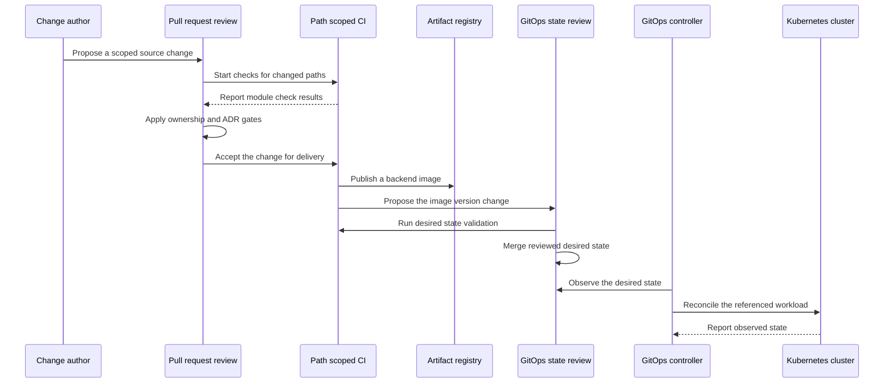

# Repository Change and Delivery Lifecycle

BidPoint is intended to keep the complete change lifecycle for one distributed product in one monorepo without turning the repository into one build, one deployment unit, or one owner. Each artifact still has exactly one owning module. Pull requests are the coordination point, path-scoped automation is intended to validate only affected modules, and Kubernetes delivery is intended to cross a hard boundary from artifact publication to declared GitOps state and then controller reconciliation.

> **Current reality:** the product lifecycle on this page is an architectural contract, not an implemented pipeline. The repository is early scaffolding: there are no backend services, client toolchains, Kubernetes manifests, Infrastructure as Code, configuration sets, per-module `CODEOWNERS` rules, or concrete product CI/CD workflows. The repository's only concrete GitHub Actions workflow is [`.github/workflows/openwiki-update.yml`](../../.github/workflows/openwiki-update.yml), which updates documentation and opens a pull request. Do not mistake that updater for a BidPoint build or deployment path.

## Two lifecycles, not one

| Lifecycle | Status | Result |
| --- | --- | --- |
| Intended product change and delivery | Design only | Review a scoped product change, run affected module checks, publish an artifact where applicable, change Kubernetes desired state, and let a GitOps controller reconcile it. Infrastructure and non-cluster releases have separate paths. |
| OpenWiki documentation update | Implemented now | On a schedule or manual dispatch, check out full history, run pinned OpenWiki tooling, and propose selected generated documentation changes on `openwiki/update`. |

The distinction matters operationally. A green OpenWiki update says nothing about product source, an infrastructure plan, an application artifact, GitOps desired state, or a cluster rollout.

## Intended product change and delivery sequence



*Figure 1. Intended backend delivery contract. The precise workflow triggers and promotion mechanics are not selected, but CI deliberately has no deployment arrow to the cluster.*

### 1. Govern and scope the change

Before editing, read [`AGENTS.md`](../../AGENTS.md) and the README of every affected module. Scope the pull request around semantic ownership rather than convenience:

1. Identify every changed artifact and its one owning module.
2. Name all affected modules in the pull request.
3. If several modules must move together, explain why the coordination is necessary. A multi-module pull request is allowed; an unexplained ownership crossing is not.
4. Keep the diff narrow. A nearby refactor or broad reformat is a separate change unless it is essential to the stated result.
5. State the target environment when applicable, and prove that a `dev`, `staging`, or `prod` change does not implicitly alter the other targets.
6. Never commit a secret value. A secret name, a `${{ secrets.NAME }}` expression, or a Kubernetes secret reference identifies where a credential will be obtained; it is not the credential itself.

The [pull request template](../../.github/pull_request_template.md) turns part of this into an author checklist: summary and rationale, affected modules, one owner per artifact, cross-module justification, secret and environment checks, responsibility documentation, and an ADR check. The template's blanket “No secrets, credentials, or environment-specific values committed” item does not create a new configuration owner: legitimate non-sensitive backend environment variants remain a `config/` concern and environment-specific workload sizing remains a `gitops/` concern. Reviewers still need to apply the module boundaries and ensure environment values have not leaked into application source or the wrong module.

### 2. Apply ownership review

Directory names do not enforce ownership. [`CODEOWNERS`](../../.github/CODEOWNERS) is the repository's intended review-routing mechanism, but its present content is only the repository-wide rule:

```text
* @LaNguAx
```

Consequently, all changed paths currently route to the same default owner; there are no backend, web, mobile, configuration, GitOps, infrastructure, automation, or documentation-specific owner rules. The pull request's module declaration and human review are therefore the only module-level checks represented in this repository today. As teams appear, path-specific entries should replace or refine the wildcard. Required code-owner approval also depends on repository review settings, which are not defined by this checkout, so this page does not claim that a branch-protection gate is currently enabled.

Cross-module coordination and architectural decision-making are different gates:

- **Explain coordination in the pull request** whenever one result needs artifacts from several existing owners.
- **Update the owning module README** when its responsibilities change.
- **Add an ADR under `docs/adr/`** when the change makes a significant architectural choice, creates or moves a source-of-truth boundary, or resolves an intentionally open decision. An ADR records context, the decision, and rejected alternatives. The static-versus-server web deployment model, backend service decomposition, and a new ownership boundary are representative ADR-level choices.
- A routine coordinated implementation of an already-decided design needs the cross-module explanation, but does not need a new ADR merely because several directories changed.

### 3. Run checks only for affected modules

[Repository automation policy](../../.github/AUTOMATION.md) intends workflows to use path filters. A mobile-only commit should not start infrastructure validation, and an infrastructure-only commit should not rebuild either client. The same principle applies within `frontend/`: `web/` and `mobile/` are independent workspace roots with separate future toolchains, dependency graphs, and CI paths, not one root frontend build.

Path scoping has two purposes:

- **Efficiency and blast-radius control:** unrelated builds, credentials, apply permissions, and release targets are not activated.
- **Boundary feedback:** if one job repeatedly needs unrelated paths from two domains to perform one responsibility, the ownership boundary or artifact interface probably needs review.

A cross-module pull request can start several independently scoped jobs. It should not be handled by one repository-wide job that hides which owner, failure, or release target is involved.

### 4. Publish artifacts without deploying cluster workloads

For a backend change, the intended boundary is:

1. Backend path checks build and test the affected service or library.
2. CI publishes the resulting container artifact to ECR.
3. Delivery automation proposes or commits the published image version in `gitops/`.
4. GitOps desired-state checks validate that change.
5. After the state change is reviewed and merged, the GitOps controller observes Git and reconciles Kubernetes toward it.

The source change and image-version change may ultimately use one coordinated pull request or successive pull requests; no promotion mechanism is implemented or selected yet. What is fixed is the handoff: the registry holds the built artifact, `gitops/` owns the version the cluster should run, and the controller owns reconciliation. **CI must not run a parallel direct cluster deployment.** Otherwise Git stops being the complete desired-state authority and the controller can reconcile against state that delivery automation bypassed.

Publication and deployment are separate success conditions. A published image that is never referenced by `gitops/` is available but not deployed. A merged image-version change that the controller cannot reconcile remains desired state, not a successful rollout. Artifact publication, Git review, controller health, and observed workload health therefore need distinct status and retry handling when the implementation arrives.

### 5. Keep infrastructure validation and apply separate

`infra/` is intended to declare the cluster and foundational AWS resources; it does not deploy software onto the cluster. Its changes are slower, stateful, higher-blast-radius, and harder to reverse than routine workload changes. Automation must consequently distinguish at least two concerns:

- **Pull-request validation:** formatting, static validation, policy and security checks, and a reviewable plan for the affected environment. These checks should not mutate infrastructure.
- **Authorized apply:** apply the reviewed infrastructure change with environment-specific credentials and controls, then verify the resulting foundation before dependent workloads rely on it.

No Terraform or OpenTofu configuration, plan workflow, state backend, approval gate, or apply workflow exists today, and even the tool choice remains open. These are required future control boundaries, not commands that can currently be run. Infrastructure apply must also remain distinct from GitOps reconciliation: `infra/` creates an EKS cluster and cloud services, while `gitops/` declares software for an already-existing cluster.

### 6. Treat configuration as its own lifecycle

A backend behavior change under `config/` is neither an image rebuild nor an infrastructure apply. The intended configuration server serves these settings to backend applications at startup and on refresh, allowing a behavior value to change without rebuilding or redeploying the consuming workload. That server and all configuration sets are still absent.

Future configuration-path checks should validate syntax and schema, reject secret values, detect a semantic property duplicated in `gitops/`, and render or otherwise compare environment-specific results. They should not rebuild unrelated clients or silently turn an application behavior change into a Kubernetes rollout. See [Configuration, Secrets, and Environment Isolation](../concepts/configuration-secrets-and-environments.md) for the setting-placement rules.

### 7. Handle non-Kubernetes artifacts as explicit exceptions

The “CI publishes but does not deploy” rule is specifically about cluster workloads. Two artifact classes can be delivered directly because they do not run in Kubernetes:

- **Mobile store releases:** `frontend/mobile/` owns build, signing, packaging, and store-release configuration that is inseparable from the client toolchain; `.github/` owns the workflow that executes it. Mobile CI may therefore deliver a release to a mobile store, where store review creates an additional release gate. Signing credentials and other secret values remain external and must be provided through secret references rather than committed configuration.
- **A static web bundle, if selected:** if an ADR chooses static hosting behind S3 or a CDN, web CI may publish that bundle directly to the external hosting target. The web deployment model is still undecided. If web is instead a Kubernetes workload, its image version must follow the same `gitops/` and controller path as the backend. No implementation should silently assume either model.

These exceptions do not authorize CI to deploy any cluster workload directly, and they do not turn distributed client configuration into a safe place for credentials. Browser and mobile artifacts are inspectable by users.

## Currently implemented OpenWiki update flow


*Figure 2. The repository's implemented automation: a documentation updater that proposes changes for review rather than a product delivery pipeline.*

### Trigger, permissions, and history

The workflow has two entrypoints:

- `workflow_dispatch` for an operator-started run;
- cron `0 8 * * *` for a daily scheduled run.

The job runs on `ubuntu-latest` with workflow-level `contents: write` and `pull-requests: write` permissions so the final action can create the branch, commit, and pull request. Its first step uses the SHA-pinned `actions/checkout` v4 action with `fetch-depth: 0`. Full history is functional, not cosmetic: `openwiki code --update` diffs `HEAD` against the commit it last documented. A shallow checkout can hide that commit and cause the update to run with an empty change summary.

### Pinned tooling and command

The runner then:

1. Uses the SHA-pinned `actions/setup-node` v4 action and Node.js `22`.
2. Installs exact global versions: `openwiki@0.4.3`, `mermaid@11.16.0`, and `jsdom@29.1.1`. The latter two provide higher-fidelity Mermaid validation.
3. Executes `openwiki code --update --print`.

The workflow sets non-secret operational values such as `OPENWIKI_PROVIDER`, `OPENWIKI_MODEL_ID`, `LANGCHAIN_PROJECT`, and tracing switches. It also maps the environment names `OPENWIKI_LANGSMITH_API_KEY` and `LANGSMITH_API_KEY` to GitHub secret references. Those identifiers and `${{ secrets... }}` expressions are safe to document; the credential values they resolve to are not. The first reference is documented as required for the LangSmith connector's code-mode pull, while the second is optional tracing authentication. The workflow comments separately note that browser-login authentication for the selected OpenAI provider has no unattended equivalent and that CI credentials must be supplied by the operator. The presence of an environment-variable name does not prove a usable credential has been configured.

### Pull request output boundary

After OpenWiki runs, the SHA-pinned `peter-evans/create-pull-request` v7 action prepares the documentation update with:

- branch `openwiki/update`;
- commit message and title `docs: update OpenWiki`;
- a generated-update pull request body;
- `add-paths` limited to `openwiki`, `AGENTS.md`, `CLAUDE.md`, and `.github/workflows/openwiki-update.yml`.

The final step therefore proposes a reviewable repository change instead of pushing product state to a runtime target. Review should still inspect all selected paths: the workflow is allowed to change its own definition as well as generated wiki content and agent guidance. The write permissions and fixed update branch are operationally significant, so dependency pin changes, permission expansion, path expansion, or command changes deserve the same ownership and secret review as any other automation change.

## Lifecycle invariants and failure semantics

| Invariant or checkpoint | Failure meaning and safe response |
| --- | --- |
| Every artifact has one semantic owner. | If ownership is ambiguous, stop and resolve the boundary; do not let a convenient workflow become a second owner. |
| Cross-module work is justified. | An unexplained broad diff may conceal coupling. Split it or explain why the owners must coordinate. |
| Significant architecture has an ADR. | If the implementation resolves an open choice without a record, it is indistinguishable from an accident and should not be merged as routine work. |
| CI is path-scoped. | A mobile change starting infrastructure apply, or an infrastructure change rebuilding both clients, indicates overbroad triggers or a broken boundary. |
| Artifact publication precedes the GitOps image update. | Do not point desired state at an artifact version that was not successfully published. Conversely, publication alone does not mean deployment. |
| CI never deploys cluster workloads directly. | A direct deployment creates state outside the Git-owned path. Recover by restoring desired state and reconciling through the controller, not by normalizing the bypass. |
| GitOps merge and runtime health are separate. | A merged declaration can still fail to reconcile. Surface controller and workload health rather than reporting merge success as rollout success. |
| Infrastructure validation is not infrastructure apply. | A valid plan authorizes nothing by itself. Apply needs its own environment controls, and failure must be handled in the infrastructure lifecycle rather than by application redeploys. |
| Secret references are not secret values. | Missing authentication should fail the relevant operation without printing or committing credentials. Never replace a missing reference with a literal value. |
| OpenWiki receives full history. | A shallow checkout can produce an empty change summary and an incomplete update; preserve `fetch-depth: 0`. |
| OpenWiki output remains reviewable. | A tooling or pull-request step failure means no reviewed documentation update was delivered. Preserve failure output, fix the failed stage, and rerun rather than bypassing the pull request. |

## Focused validation as implementation arrives

There is currently no product test suite or product workflow to invoke. Future automation should select the narrowest checks that establish the changed owner's contract:

| Changed owner | Focused pull-request evidence | Delivery or apply boundary |
| --- | --- | --- |
| `backend/` | Affected service or library tests, API or contract checks, and a reproducible container build | Publish to ECR, then update the image version in `gitops/`; do not deploy the cluster from CI |
| `frontend/web/` | Standalone web workspace tests and build, plus inspection that shipped settings are non-sensitive | Direct static publication only after that model is chosen; otherwise use the selected server path, with GitOps for a cluster workload |
| `frontend/mobile/` | Standalone mobile tests, packaging checks, and verification that bundles contain no secrets | Sign and submit through the mobile release path with externally supplied credentials and store review |
| `config/` | Syntax or schema checks, duplicate-property detection, secret scanning, and target-environment isolation | Make settings available through the intended configuration service without rebuilding the consumer |
| `gitops/` | Render and schema or policy validation per environment, image-reference checks, and proof that non-target environments are unchanged | Merge desired state and observe controller plus workload health |
| `infra/` | Formatting, validation, policy and security checks, and a reviewed target-specific plan | Run a separately authorized apply and verify foundations before dependent GitOps reconciliation |
| `.github/` | Workflow syntax, action and tool pinning, least-required permissions, path-filter tests, and safe handling of secret references | Exercise the narrow workflow entrypoint; for OpenWiki, manual dispatch is the concrete entrypoint |
| `docs/` and governance files | Link, template, ownership-policy, ADR, and Mermaid validation as relevant | Merge reviewed knowledge; do not run unrelated product delivery |

The exact commands cannot be documented until each module has a toolchain. Adding a generic repository-wide “test everything” job now would hide rather than implement the intended boundaries.

## Safe automation extension points

When concrete product automation is added:

1. Add path-specific `CODEOWNERS` entries at the same time module teams become real; do not claim module enforcement while only the wildcard exists.
2. Give each workflow explicit path triggers and narrowly scoped permissions. Release, infrastructure apply, and pull-request validation jobs should not share credentials merely because they live under `.github/`.
3. Preserve artifact identity across publication and the `gitops/` image update so reviewers and operators can tell which built version is requested.
4. Validate desired state before merge, then observe controller and workload status after merge. Keep CI's cluster credentials unnecessary for normal workload delivery.
5. Implement infrastructure plan and apply as separate authorization concerns and keep both separate from the GitOps workload path.
6. Encode environment selection explicitly and test all non-target environments for unchanged output.
7. Record still-open architecture choices before a workflow bakes them in. In particular, choose the web deployment model by ADR before implementing static publication or a cluster delivery path.
8. Continue using pull requests for generated OpenWiki changes. The updater's full-history checkout, exact tool versions, bounded output paths, and secret references are part of its current operating contract.

## Related pages

- [Application Domains and Client Boundaries](../architecture/application-domains.md)
- [Ownership and System Boundaries](../architecture/ownership-and-system-boundaries.md)
- [Configuration, Secrets, and Environment Isolation](../concepts/configuration-secrets-and-environments.md)
- [Quickstart](../quickstart.md)
