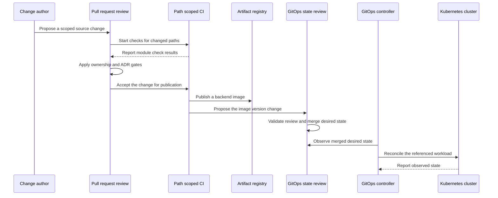
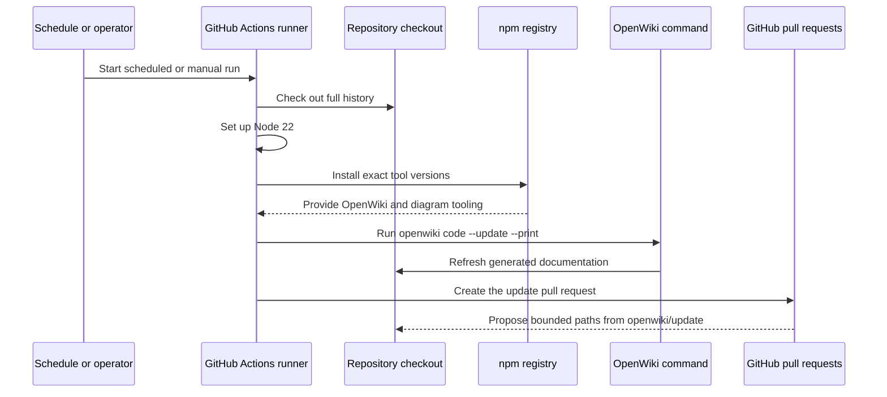

# Repository Change and Delivery Lifecycle

BidPoint is intended to keep the complete change lifecycle for one distributed product in one monorepo without turning the repository into one build, one deployment unit, or one owner. Every committed artifact has exactly one owning module. Pull requests coordinate owners, future path-scoped automation validates only affected modules, and cluster delivery deliberately crosses from artifact publication to reviewed GitOps desired state and then to controller reconciliation.

> **Current reality:** the product lifecycles on this page are architectural contracts, not implemented pipelines. The repository is early scaffolding: there are no backend services, client toolchains, Kubernetes manifests, Infrastructure as Code, configuration sets, per-module `CODEOWNERS` rules, or concrete product CI/CD workflows. Concrete product CI/CD and validation commands do not yet exist. The only implemented GitHub Actions workflow is [`.github/workflows/openwiki-update.yml`](../../.github/workflows/openwiki-update.yml), which refreshes documentation and opens a pull request. It does not build, validate, publish, deploy, or reconcile the BidPoint product.

## Intended product delivery versus implemented documentation automation

| Lifecycle | Status | Result |
| --- | --- | --- |
| Intended product change governance | Design only | Scope a change by owner, review its boundaries and architecture impact, and run future checks only for affected modules. |
| Intended product delivery lifecycles | Design only | Independently publish artifacts, change GitOps desired state, reconcile clusters, plan and apply infrastructure, refresh backend configuration, or deliver a non-cluster artifact as appropriate. |
| OpenWiki documentation update | Implemented now | On a schedule or manual dispatch, check out full history, run pinned OpenWiki tooling, and propose selected documentation and guidance changes on `openwiki/update`. |

These results are not interchangeable. A green OpenWiki update says nothing about product source, an application artifact, an infrastructure plan, GitOps desired state, a controller, a cluster rollout, or configuration refresh.

## Intended cluster-workload sequence



*Figure 1. Intended backend delivery contract; exact triggers and promotion mechanics are not selected, and CI deliberately has no deployment arrow to the cluster.*

The diagram connects the expected handoffs, but it is not one transaction. Artifact publication, desired-state review, and runtime reconciliation have different state owners, success criteria, and recovery paths. Infrastructure, configuration refresh, and non-cluster delivery do not run through this sequence.

## Govern and scope every change

### Read owners before editing

Read [`AGENTS.md`](../../AGENTS.md), the root [`README.md`](../../README.md), and the README of every affected module. Choose placement by semantic responsibility rather than directory convenience:

1. Identify every changed artifact and assign it exactly one owning module.
2. Name all affected modules in the pull request.
3. If several modules must move together, explain why the result requires cross-module coordination. Coordination does not create joint ownership.
4. Keep the diff narrow. An adjacent refactor, broad reformat, or single-use abstraction is a separate concern unless required for the stated result.
5. State environment scope when applicable. The exact model is `local`, `dev`, `stage`, and `prod`: `local` is development on a developer machine, while `dev`, `stage`, and `prod` are separate remote Kubernetes targets. A change intended for any one must not implicitly alter another.
6. Never commit passwords, tokens, API keys, credential-bearing connection strings, or other secret values. Git may hold references such as `${{ secrets.NAME }}` or a Kubernetes secret reference, but not the value they resolve to.

### Use the current pull-request checklist exactly

The [pull request template](../../.github/pull_request_template.md) asks for a summary of what changes and why, then asks which modules own the changed artifacts and why several modules must coordinate when applicable. Its current checklist requires authors to confirm:

- every changed artifact has exactly one owning module;
- cross-module coordination is explained above when applicable;
- no secrets or credentials are committed, and no environment knowledge is hardcoded in application code;
- the module README is updated if responsibilities changed; and
- an ADR is added under `docs/adr/` if the change introduces an architectural decision.

The environment item is about **hardcoded application knowledge**, not a ban on legitimate environment-specific declarations. Non-sensitive backend behavior variants belong under `config/`; remote workload sizing and image state belong under `gitops/`; cloud foundations belong under `infra/`; and each frontend owns its own non-sensitive settings. Reviewers must ensure each declaration stays with its owner and remains isolated across `local`, `dev`, `stage`, and `prod`.

### Route review through ownership and architecture gates

Directory names do not enforce ownership. [`CODEOWNERS`](../../.github/CODEOWNERS) is the intended review-routing mechanism, but today it contains only this repository-wide default:

```text
* @LaNguAx
```

All paths therefore route to the same owner. There are no backend, web, mobile, configuration, GitOps, infrastructure, automation, or documentation-specific owner rules. The pull request's module declaration and human review are the only module-level checks represented in the checkout. Required code-owner approval also depends on repository settings that are not present here, so the repository does not establish that branch protection currently enforces it.

Cross-module coordination and architectural decision-making are related but separate gates:

- **Explain coordination in the pull request** whenever one result requires artifacts from several owners.
- **Update an owning module's README** when its responsibility changes.
- **Add an ADR under `docs/adr/`** for a significant architectural choice, a new or moved source-of-truth boundary, or resolution of an intentionally open decision. An ADR records context, the selected decision, and rejected alternatives.
- A routine implementation of an already-decided design may need cross-module explanation without needing a new ADR merely because several directories change.

The undecided web hosting model, backend service decomposition, and creation or movement of an ownership boundary are representative ADR-level choices.

## Validate only affected owners

[Repository automation policy](../../.github/AUTOMATION.md) intends product workflows to use path filters. A mobile-only change should not start infrastructure validation, and an infrastructure-only change should not rebuild either client. Within `frontend/`, `web/` and `mobile/` are independent future workspace roots with separate toolchains, dependency graphs, and CI paths rather than one shared frontend build root. None of those concrete mechanisms exists yet.

Path scoping serves two purposes:

- **Efficiency and blast-radius control:** unrelated builds, credentials, apply permissions, and release targets are not activated.
- **Boundary feedback:** if one job repeatedly needs paths from unrelated domains to perform one responsibility, the ownership boundary or artifact interface probably needs review.

A cross-module pull request can eventually start several independently scoped jobs. It should not be collapsed into one repository-wide job that hides which owner, validation, failure, credential, or release target is involved.

## Separate the intended delivery lifecycles

The repository describes several intended delivery paths, not one universal pipeline. Their boundaries and failure meanings must remain distinct when automation is implemented.

| Lifecycle | Source and state owner | Intended success | Failure does **not** mean |
| --- | --- | --- | --- |
| Artifact publication | Application source in `backend/`; built image in ECR | A tested, identifiable image is available in the registry | That `gitops/` references it or that any cluster runs it |
| GitOps desired-state change | Image and workload declaration in `gitops/` | The intended image version and workload state pass review and are merged into Git | That a controller observed the commit or the workload became healthy |
| Controller reconciliation | GitOps controller and Kubernetes observed state | The target cluster converges on merged desired state and reports the workload's observed health | That artifact publication, Git review, or infrastructure apply can be skipped |
| Infrastructure plan and apply | Definitions in `infra/`; live cloud foundation outside Git | Validation and a reviewable target-specific plan precede a separately authorized apply and foundation verification | That Kubernetes workloads were reconciled or application behavior was validated |
| Configuration delivery and refresh | Behavior values in `config/`; intended configuration server and consuming backend | The intended target's settings are served and accepted at startup or refresh | That an image was rebuilt, a pod was recreated, or Kubernetes state changed |
| Non-cluster delivery | Mobile package or possible static web bundle and its external target | The artifact reaches its distribution target, subject to target-specific gates | Permission to deploy any Kubernetes workload directly from CI |

### Artifact publication

For a backend source change, future path-scoped CI is intended to build and test the affected service or library and publish its container artifact to ECR. `backend/` owns source, [`.github/`](../../.github/AUTOMATION.md) owns the workflow, and the external registry owns the published bytes. Backend source does not own deployment infrastructure.

Publication must complete before desired state references the new image. A publication failure stops at the registry boundary: no image-version change should point at the missing artifact. Conversely, a successful publication leaves an available but unused image until a separate `gitops/` change selects it. Artifact identity must survive the handoff so reviewers can connect a desired image version to the build that produced it.

### GitOps desired-state change

[`gitops/`](../../gitops/README.md) is intended to be the Git source of truth for software running on an already-existing cluster. After publication, delivery automation may propose or commit the image version in `gitops/`, and desired-state checks should validate the target environment before merge. The repository has not chosen whether source and image-version changes use one coordinated pull request, successive pull requests, or another promotion mechanism.

A rejected or invalid desired-state change does not invalidate the published image; it means that image has not been selected for the target. A merged declaration is still only desired state. **CI must not compensate by issuing a direct cluster deployment.** That would create state outside the Git-owned path and allow the controller to reconcile against a declaration CI bypassed.

### Controller reconciliation

A GitOps controller such as ArgoCD is intended to observe merged declarations and reconcile the target cluster. `gitops/` assumes the cluster exists; it does not provision infrastructure. Reconciliation is successful only when the controller and Kubernetes observed state converge and the relevant workload is healthy—not merely when Git merge succeeds.

A reconciliation failure leaves a meaningful distinction: Git still records what should run, while the controller or cluster reports that observed state has not reached it. Recovery belongs at the controller, manifest, artifact, or workload boundary indicated by that status. It must not be hidden by reporting merge success as rollout success or by adding a parallel CI deployment path. No controller, manifests, cluster integration, health checks, or recovery automation exists today.

### Infrastructure plan and apply

[`infra/`](../../infra/README.md) is intended to declare the EKS clusters and foundational AWS resources; [`.github/`](../../.github/AUTOMATION.md) owns workflows that validate and apply those definitions. Infrastructure changes are slower, stateful, higher-blast-radius, and harder to reverse than routine workload changes, so validation and mutation need separate controls:

1. **Pull-request validation** should format and statically validate the affected definitions, run future policy and security checks, and produce a reviewable plan for the explicit remote target. It should not mutate infrastructure.
2. **Authorized apply** should use target-specific credentials and controls to apply the reviewed change, then verify the foundation before dependent workloads rely on it.

A valid plan is evidence for review, not an applied change. An apply or verification failure belongs to the infrastructure lifecycle and must not be treated as something an application republish or GitOps retry can repair. Infrastructure apply also remains separate from workload reconciliation: `infra/` creates clusters and cloud services, while `gitops/` declares software for clusters that already exist.

No Terraform or OpenTofu configuration, state backend, plan workflow, approval gate, apply workflow, or environment topology is implemented. Terraform or OpenTofu is only a likely future mechanism; the tool choice remains open.

### Configuration delivery and refresh

A backend behavior change under [`config/`](../../config/README.md) is neither an image rebuild nor an infrastructure apply. The intended configuration server serves values to backend applications at startup and on refresh, allowing behavior to change without rebuilding or redeploying the consuming workload. The configuration-server workload would itself be deployed through GitOps, but the behavior values it serves remain owned by `config/`.

Future configuration checks should validate syntax and schema, reject secret values, detect a semantic backend property duplicated in `gitops/`, and compare environment-specific results. Runtime success then requires the configuration server and consumer to accept the selected target's value. A validation failure, serving failure, or refresh failure must remain visible as a configuration concern; rebuilding an unchanged image or reapplying infrastructure is not proof of recovery. The repository has not selected a refresh trigger, propagation guarantee, rollback procedure, or `local` delivery mechanism. No configuration sets or configuration server exist today.

See [Configuration, Secrets, and Environment Isolation](../concepts/configuration-secrets-and-environments.md) for placement rules and the narrow bootstrap allowance in `gitops/`.

### Non-cluster delivery

The “CI publishes but does not deploy” rule is specifically about Kubernetes workloads. The documented direct-delivery exceptions are artifacts that do not run in a cluster:

- **Mobile store releases:** `frontend/mobile/` owns build, signing, packaging, and store-release configuration inseparable from the client toolchain; `.github/` owns the workflow that executes it. Mobile CI may deliver a release to a mobile store, where store review is an additional release gate. Signing credentials and other secret values remain external and are supplied only through references.
- **A static web bundle, if selected:** if an ADR chooses static hosting behind S3 or a CDN, web CI may publish that bundle directly to the hosting target. The web deployment model is still undecided between static hosting and a server runtime. Application code must not encode either assumption. If web becomes a cluster workload, its image version must follow the GitOps and controller path.

A store rejection, signing failure, or static-host publication failure is local to that distribution path; it does not authorize cluster access or imply a GitOps reconciliation failure. These exceptions also do not make distributed client configuration safe for credentials: browser output, mobile bundles, and device traffic are inspectable by users. No mobile, web, signing, store, or static-host workflow exists today.

## Currently implemented OpenWiki update flow



*Figure 2. The repository's implemented automation is a documentation updater that proposes selected changes for review, not a BidPoint validation or delivery pipeline.*

### Trigger, permissions, and runner

The workflow has two entrypoints: `workflow_dispatch` for an operator-started run and cron `0 8 * * *` for a daily scheduled run. It grants workflow-level `contents: write` and `pull-requests: write`, then runs one `update` job on `ubuntu-latest`. Those write permissions support the update branch, commit, and pull request; they do not provide or imply product deployment behavior.

### Exact checkout, tooling, and command order

| Order | Implemented step | Exact operating detail |
| --- | --- | --- |
| 1 | Check out repository | `actions/checkout@34e114876b0b11c390a56381ad16ebd13914f8d5` (`v4`) with `fetch-depth: 0` |
| 2 | Set up Node.js | `actions/setup-node@49933ea5288caeca8642d1e84afbd3f7d6820020` (`v4`) with `node-version: "22"` |
| 3 | Install OpenWiki and diagram tooling | `npm install --global openwiki@0.4.3 mermaid@11.16.0 jsdom@29.1.1` |
| 4 | Run OpenWiki | `openwiki code --update --print` |
| 5 | Create the pull request | `peter-evans/create-pull-request@22a9089034f40e5a961c8808d113e2c98fb63676` (`v7`) |

Full history is functional rather than cosmetic. `openwiki code --update` diffs `HEAD` against the commit it last documented; a shallow checkout can hide that commit and make the updater run against an empty change summary. The workflow pins both GitHub actions and global npm package versions. `mermaid@11.16.0` and `jsdom@29.1.1` are installed for higher-fidelity Mermaid validation.

### OpenWiki environment and secret references

The OpenWiki step supplies these non-secret operating settings:

| Environment name | Configured value or source |
| --- | --- |
| `OPENWIKI_PROVIDER` | `openai-chatgpt` |
| `OPENWIKI_MODEL_ID` | `"gpt-5.6-sol"` |
| `LANGCHAIN_PROJECT` | `openwiki` |
| `LANGCHAIN_TRACING_V2` | `"true"` |
| `OPENWIKI_LANGSMITH_API_KEY` | `${{ secrets.OPENWIKI_LANGSMITH_API_KEY }}` |
| `LANGSMITH_API_KEY` | `${{ secrets.LANGSMITH_API_KEY }}` |

The workflow documents `OPENWIKI_LANGSMITH_API_KEY` as required for the LangSmith connector's code-mode pull and notes the numbered `_2`, `_3`, and later convention for extra workspaces. `LANGSMITH_API_KEY` is optional authentication for tracing the workflow's own OpenWiki run. The comments also state that browser-login authentication for the selected OpenAI provider has no unattended equivalent and that an operator must supply CI credentials. Environment names and GitHub secret expressions identify credential sources; they are not credential values and do not prove that usable secrets have been configured.

### Bounded update branch and pull request

The create-pull-request step uses:

- branch `openwiki/update`;
- commit message `docs: update OpenWiki`;
- pull request title `docs: update OpenWiki`;
- body `Automated OpenWiki documentation update.` followed by `This PR was generated by the scheduled OpenWiki workflow.`; and
- `add-paths` limited to `openwiki`, `AGENTS.md`, `CLAUDE.md`, and `.github/workflows/openwiki-update.yml`.

The last step therefore proposes only those paths for human review rather than publishing product state. It can include the updater's own workflow definition as well as wiki content and agent guidance, so reviewers should inspect action and package pins, permissions, command changes, secret references, the fixed branch, and any expansion of `add-paths`.

A checkout, setup, install, OpenWiki, authentication, or pull-request-action failure is a documentation-update failure. The safe response is to preserve the failed step's output, correct that boundary, and rerun; it is not evidence of product failure and must not be bypassed by treating generated output as deployed state. Conversely, a created OpenWiki pull request only proves that selected documentation changes were proposed. This workflow contains no product build, product test, artifact publication, infrastructure plan or apply, GitOps validation, configuration refresh, or deployment step.

## Lifecycle invariants and failure semantics

| Invariant or checkpoint | Failure meaning and safe response |
| --- | --- |
| Every committed artifact has one semantic owner. | Stop and resolve ambiguity; do not let a convenient workflow or coordinated pull request become a second owner. |
| Cross-module work is justified. | An unexplained broad diff may conceal coupling. Split it or explain why the owners must coordinate. |
| Significant architecture has an ADR. | Do not merge an implementation that silently resolves an open choice; record context, decision, and rejected alternatives. |
| Environment knowledge is not hardcoded in application code. | Inject target knowledge through the owning configuration boundary so one artifact can be used across `local`, `dev`, `stage`, and `prod`. |
| Environment effects are isolated. | Prove a change intended for one of `local`, `dev`, `stage`, or `prod` does not implicitly change another. |
| Product CI is path-scoped. | A mobile change starting infrastructure apply, or an infrastructure change rebuilding both clients, indicates an overbroad trigger or broken boundary. |
| Artifact publication precedes the GitOps image update. | Do not point desired state at an image that was not successfully published; do not report publication alone as deployment. |
| CI never deploys cluster workloads directly. | Restore reviewed Git-owned desired state and reconcile through the controller rather than normalizing the bypass. |
| GitOps merge and runtime health are separate. | Surface controller and workload health; a merged declaration can still fail to reconcile. |
| Infrastructure validation is not infrastructure apply. | A valid plan authorizes nothing by itself. Apply needs target-specific controls and independent verification. |
| Configuration refresh is not image or workload delivery. | Diagnose validation, serving, and consumer acceptance without rebuilding or redeploying unrelated state as a substitute. |
| Secret references are not secret values. | Missing authentication should fail the relevant operation without printing or committing credentials; never replace a missing reference with a literal value. |
| OpenWiki receives full history. | A shallow checkout can produce an empty change summary and incomplete documentation; preserve `fetch-depth: 0`. |
| OpenWiki output remains reviewable and bounded. | Fix the failed updater stage and rerun. Do not expand paths or bypass its pull request to compensate. |

## Focused validation as implementation arrives

There is currently no product test suite, repository-wide product command, deployable stack, or product workflow to invoke. Future automation should select the narrowest checks that establish the changed owner's contract; the entries below are requirements for later workflow design, not runnable commands today.

| Changed owner | Focused pull-request evidence | Delivery or apply boundary |
| --- | --- | --- |
| `backend/` | Affected service or library tests, API or contract checks, and a reproducible container build | Publish to ECR, then update the image version in `gitops/`; never deploy the cluster from CI |
| `frontend/web/` | Standalone web workspace tests and build, plus inspection that shipped settings are non-sensitive | Publish directly only if static hosting is selected; use GitOps if web becomes a cluster workload |
| `frontend/mobile/` | Standalone mobile tests, packaging checks, and proof that bundles contain no secrets | Sign and submit through the mobile path with externally supplied credentials and store review |
| `config/` | Syntax or schema checks, duplicate-property detection, secret scanning, and target isolation across `local`, `dev`, `stage`, and `prod` | Make settings available through the intended configuration service without rebuilding the consumer |
| `gitops/` | Render and schema or policy validation for `dev`, `stage`, and `prod`, image-reference checks, and proof that non-target output is unchanged | Merge desired state, then separately observe controller and workload health |
| `infra/` | Formatting, validation, policy and security checks, and a reviewed target-specific plan for `dev`, `stage`, or `prod` | Run a separately authorized apply and verify the foundation before dependent reconciliation |
| `.github/` | Workflow syntax, action and tool pinning, least-required permissions, path-filter tests, and safe secret references | Exercise only the narrow workflow entrypoint; `workflow_dispatch` is the concrete OpenWiki entrypoint |
| `docs/` and governance files | Link, template, ownership-policy, ADR, and Mermaid validation as relevant | Merge reviewed knowledge without starting unrelated product delivery |

Adding a generic “test everything” job before module toolchains exist would hide rather than implement the intended boundaries. Exact commands belong in each module only after its implementation and toolchain are selected.

## Safe automation extension points

When concrete product automation is added:

1. Add path-specific `CODEOWNERS` entries when real module teams exist; do not claim module enforcement while only the wildcard remains.
2. Give every workflow explicit path triggers and narrowly scoped permissions. Pull-request validation, release, infrastructure apply, and documentation update jobs should not share credentials merely because all workflows live under `.github/`.
3. Preserve artifact identity from publication into the `gitops/` image change, and block references to artifacts that were not published successfully.
4. Validate desired state before merge, then report controller and workload status after merge. Keep ordinary cluster-delivery credentials out of CI.
5. Implement infrastructure plan and apply as separate authorization concerns and keep both separate from GitOps workload reconciliation.
6. Validate configuration as a separate artifact and surface refresh or consumer-acceptance failures independently from image and workload status.
7. Encode environment selection explicitly using only `local`, `dev`, `stage`, and `prod`; for target-specific changes, prove all non-target outputs remain unchanged.
8. Keep non-cluster releases explicit. Mobile store delivery and a possible static web publication path need their own credentials, gates, and failure reporting.
9. Record open architecture choices before a workflow bakes them in. In particular, choose the web deployment model by ADR before implementing static publication or a cluster path.
10. Continue using pull requests for generated OpenWiki changes. Its full-history checkout, pinned actions and packages, exact command, secret references, fixed branch, and bounded `add-paths` are part of the implemented operating contract.

## Related pages

- [Application Domains and Client Boundaries](../architecture/application-domains.md)
- [Ownership and System Boundaries](../architecture/ownership-and-system-boundaries.md)
- [Configuration, Secrets, and Environment Isolation](../concepts/configuration-secrets-and-environments.md)
- [Quickstart](../quickstart.md)
