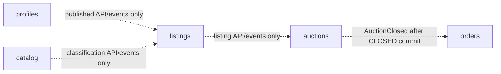

# Core platform modular monolith

Status: Canonical
Last validated: 2026-08-01

`core-platform` is the target Spring Modulith modular monolith for the marketplace capabilities that benefit from cohesive evolution and local transactions. This is a target design in a documentation-only repository, not an implemented service. It deliberately keeps profiles, catalog, listings, auction lifecycle, and orders together while making their ownership boundaries executable and ready for later extraction only when evidence justifies it.

## Why a modular monolith

These five capabilities share an early product cadence: listing readiness refers to category rules and auction configuration; an auction lifecycle refers to a listing; the auctions-owned `AuctionClosed` fact initiates a durable order after the `CLOSED` commit. Splitting each into a network service now would add failure modes without adding an independent scaling, consistency, or integration responsibility. A Spring Modulith keeps ordinary changes locally transactional while preventing the convenience of a shared codebase from becoming permission to couple internals.

The boundary is architectural, not merely organizational. A module is the only writer of its logical schema and exposes behavior through its Java API or events. Other Core modules do not import another module's persistence model, repository, controller, DTO implementation, or internal service. A future extraction replaces a stable module-facing contract with a remote/API-event contract; it must not begin with a database split or a copied table.

## Module authority

| Module | Owns | Exposes | Must not own |
| --- | --- | --- | --- |
| `profiles` | Marketplace profile keyed by the validated Keycloak subject; idempotent onboarding after verified Keycloak identity evidence; display and marketplace preferences. | Profile behavior and producer-owned `UserRegistered` after marketplace profile activation. | Passwords, credentials, MFA, sessions, tokens, identity administration, or a Keycloak credential-creation event. |
| `catalog` | Categories and classification rules. | Classification behavior and category facts. | Listing content or publish state. |
| `listings` | Listing draft/content, image metadata, publish readiness, and publication. S3 holds image objects, not marketplace authority. | Listing commands, read behavior, and publication facts. | Category-rule authority, auction timing, bids, or S3 credentials. |
| `auctions` | Scheduling, authoritative `closeAt`, lifecycle version, lifecycle/reserve/cancellation, and `CLOSING` while a bid fence is pending. | Lifecycle behavior, close/cancel orchestration, and producer-owned `AuctionClosed` after the `CLOSED` commit. | Authoritative bid price/winner, bid ordering, or bid acceptance. |
| `orders` | Durable post-auction buyer/seller order and history records. | Order behavior and order facts. | Payment charging, provider integration, or payment state. |

An auction close or cancellation is a cross-owner flow. `auctions` commits `CLOSING` and retries the same idempotent Bidding REST fence/finalize command until its stable acknowledgement/final outcome returns; that result is not the order trigger. For close, `auctions` then atomically commits `CLOSED` and one producer-owned `AuctionClosed` (winner/no-winner, final price, lifecycle version, stable identity) through the durable Spring Modulith event-publication/outbox mechanism. `orders` consumes only that fact after commit and deduplicates by event/auction identity. The same fact may be externalized to Kafka with the same identity. A bidding-owned final-outcome fact is audit/projection input only and cannot create an order. Cancellation commits `CANCELLED` without `AuctionClosed`.

## Package and artifact contract

Each Core module is one Maven JAR: there are no separate `-api` and implementation artifacts. Its top-level shape is intentionally predictable:

```text
modules/<module>/
  api/                         Java interfaces usable by another Core module
    events/                    separately named Spring Modulith internal-event interface
  contracts/events/            producer-owned external Kafka wire contracts
  internal/
    controller/                Spring MVC adapter where the module owns HTTP endpoints
    dto/                       adapter DTOs
    service/                   application/domain orchestration
    model/                     module-owned domain and persistence model
    repository/                module-owned persistence access
```

`api/` is the only Java surface another Core module may compile against. `api/events/` makes internal Spring Modulith events explicit rather than leaking an implementation class as an event type. `contracts/events/` is not an internal API: it contains the producer-owned external Kafka wire contract, versioned independently from private model classes. A consumer treats it as a published contract and does not reach into the producer's `internal/` packages.

The `internal/` subtree is deliberately broad enough for conventional Spring MVC implementation concerns, but additions require a module-specific reason. Do not create arbitrary shared layers or capability trees before a genuine second capability needs them. Surrounding non-reactive services use familiar top-level Spring MVC packages (`controller`, `dto`, `service`, `model`, `repository`, `config`, `client`, `messaging`) and apply the same restraint.

## Enforceable dependency rules

Spring Modulith module detection is configured explicitly rather than inferred from accidental package placement. `ApplicationModules.verify()` is a required architecture check. Module integration tests exercise exported API/event behavior across a real application context, and ArchUnit prevents imports from one module's `internal` packages into another module. The verification suite also rejects cycles and makes the intended allowed dependencies visible.

The intended dependency directions are:



This diagram shows only meaningful explicit relationships. `orders` consumes auctions-owned `AuctionClosed` only after the `CLOSED` commit; it neither inspects bid tables nor treats a bidding-owned outcome as a trigger. Modules may share a PostgreSQL deployment/database initially, but each owns a logical schema. Sharing operations never permits cross-schema writes or joins as a module integration technique.

## Transaction and publication responsibilities

Within a module, a command commits authoritative state and any durable event-publication/outbox row atomically. In particular, `auctions` commits `CLOSED` with exactly one stable `AuctionClosed` publication. Spring Modulith delivers it after commit; externalization may relay the same identity to Kafka later. A crash after commit leaves recoverable work. Transactions do not cross database owners.

The Core does not promise end-to-end exactly-once delivery. Consumers use stable event IDs and inbox/deduplication records (or an equivalent durable mechanism), allowing at-least-once delivery without a duplicate order, notification intent, or externally visible action. Query-side projections may lag; authoritative commands continue to route to the owning module/service.

## Extraction guardrails

Extraction is a later decision supported by evidence such as materially independent load, deployment cadence, data ownership, or failure isolation. Before extraction, preserve the module's API/event contract, establish its owned migration history and data boundary, then move one authority without allowing a transitional shared-writer state. Do not extract `profiles`, `catalog`, or `listings` merely for symmetrical service counts; do not re-centralize bidding or payment authority in Core for convenience.

## Acceptance evidence for later implementation

- `ApplicationModules.verify()` passes with explicit module detection.
- ArchUnit demonstrates that no module imports another module's `internal` package.
- Module integration tests prove API/event interactions without direct repository access.
- Tests prove the fence acknowledgement creates no order; `CLOSED` and one `AuctionClosed` commit atomically; `orders` runs only after commit; and redelivery creates at most one order by event/auction deduplication.
- Schema/migration review shows a single logical writer per module schema even if Core initially shares a PostgreSQL deployment.
