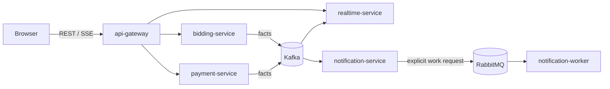

# Microservice boundaries

Status: Canonical
Last validated: 2026-08-01

BidPoint uses services where a responsibility needs independent authority, failure handling, scaling, or integration isolation. This is the target architecture, not a description of running software. It is intentionally not a catalogue of CRUD services: Core remains a modular monolith, and every surrounding deployable has a concrete responsibility that cannot safely be reduced to a controller in another owner.

## Boundary map

| Deployable | Authority and reason to exist | Inputs and outputs | Does not own |
| --- | --- | --- | --- |
| `api-gateway` | Public edge built with Spring Cloud Gateway Server WebFlux. It centralizes public routing, CORS, request/correlation IDs, trace propagation, early JWT rejection, and Redis-backed rate limits. | Browser/public REST and SSE routes to Kubernetes Services. | Business authorization, domain data, identities, or credentials. |
| `bidding-service` | Authoritative bid state requires a focused concurrency and ordering boundary per auction. It owns acceptance, bidder checks, idempotency, a local auction-state projection, and a bid outbox. | REST commands; consumes lifecycle facts; publishes bid facts to Kafka. | Auction scheduling/lifecycle authority, payment, orders, or client fan-out. |
| `payment-service` | Provider interaction needs isolated payment state, verified webhooks, audit, idempotency, retry/reconciliation policy, and its own outbox. | Payment commands/provider callbacks; publishes payment facts to Kafka. | Card data, order ownership, or marketplace profile authority. |
| `realtime-service` | A derived streaming boundary consumes durable facts and makes live fan-out/reconnect scalable without making Redis authoritative. | Kafka facts; Redis-backed fan-out/replay; SSE from every replica. | Bid/auction truth, command validation, or durable business authority. |
| `notification-service` | Notification policy is distinct from provider delivery and records a durable intent plus PostgreSQL job outbox. | Kafka business facts; publishes explicit RabbitMQ work requests. | Direct provider calls, competing-worker execution, or sender credential storage in code. |
| `notification-worker` | Delivery is targeted, retryable work for competing consumers. It records attempts, idempotently invokes providers, classifies retryability, and sends terminal failures to DLQ. | RabbitMQ jobs to providers; delivery outcomes/audit. | Which facts deserve a notification or business notification policy. |
| `search-service` | **Staged:** independently owns derived OpenSearch indexing and full-text REST queries once justified. | Kafka listing facts and REST search queries. | Day-one browse/filter, source listing data, or write authority for listings. |

Every extracted service owns its database/schema and migration history. No service joins another service's database or writes its schema. Cross-service reads use a synchronous API when current owner state is needed, or an owner-local projection when lag is acceptable. PostgreSQL is authoritative; Redis is acceleration/ephemeral coordination; S3 is object storage; OpenSearch is a staged derived store.

## Communication contract

Public synchronous traffic is REST through `api-gateway`. Internal synchronous traffic is REST over Kubernetes Services and DNS; Kubernetes-native discovery is sufficient, so the baseline excludes Eureka and a Spring Cloud Kubernetes discovery server. Kafka transports durable, replayable business facts. RabbitMQ transports targeted work requests for competing consumers. Browser live updates are SSE, not WebSockets by default.

The gateway is reactive because Spring Cloud Gateway Server WebFlux is reactive; ordinary backend services use Spring MVC top-level packages unless a selected SSE implementation requires a streaming model. Kubernetes Gateway API is a configuration API, not the runtime application gateway. The application gateway is explicitly Spring Cloud Gateway.

## Front-door boundaries

Local ingress is `client -> external pinned Traefik -> Spring Cloud Gateway -> Kubernetes Service -> backend`. Traefik is the cluster edge, while Spring Cloud Gateway owns the application-edge concerns above. The AWS path is `Route 53 DNS -> AWS WAF -> ALB (via AWS Load Balancer Controller) -> Spring Cloud Gateway -> Kubernetes Service -> backend`. Keycloak has its own authentication host/path and is never routed through the application gateway. AWS API Gateway is excluded.

## Service-specific correctness contracts

### Bidding service

For a single `auctionId`, accepted bids must retain one authoritative current price and at most one current winner. The service checks its local auction-state projection, auction eligibility, minimum increment, lightweight bidder rules, and idempotency at the write boundary. It deliberately selects optimistic locking, pessimistic locking, or an atomic database operation only after measurement; load/concurrency tests must prove the invariant and characterize hot records. Auction facts are partitioned by `auctionId` to preserve per-auction ordering, with load tests and mitigations for hot Kafka partitions.

The projection includes Core `auctions`' authoritative `closeAt` and monotonically increasing `lifecycleVersion`. Bid acceptance uses trusted server/database time and rejects at or after `closeAt`; it ignores client time. Core close or cancel first commits `CLOSING`, then calls an idempotent REST fence/finalize command carrying a stable command identity and lifecycle version. The fence and bid acceptance serialize at the same per-auction write boundary, so every in-flight bid is ordered before or after the fence. The committed fence stores a stable acknowledgement and final outcome, and duplicate commands return that result. Opening projection lag may reject a bid conservatively; close/cancel lag may never accept one after the fence or time boundary.

### Payment service

Payments cannot charge twice. Stable payment intents and provider identifiers, verified webhook signatures, replay protection, durable audit, bounded retry with jitter, and provider reconciliation protect that invariant. The provider is **Open** and is not selected here. Card data never enters BidPoint scope. A rejected or unknown webhook is not a trusted business fact, and an ambiguous provider timeout is reconciled before another provider action.

### Realtime service

Realtime facts can lag. Each replica serves SSE, while Redis supports fan-out and bounded replay rather than becoming a source of business truth. On reconnect the client provides its last event ID; when the retained replay window cannot bridge the gap, the service sends a refetch signal and the client obtains authoritative REST state. Dropped connections and consumer lag are expected, observable conditions, not reasons to weaken bid acceptance.

### Notification split

The split makes policy durable before delivery. Canonical learning flow: Core `profiles` publishes producer-owned `UserRegistered` only after idempotent marketplace profile activation from verified Keycloak identity evidence; this is not Keycloak credential creation. `notification-service` consumes the fact and decides that a welcome email is needed; it stores notification intent and a `SendWelcomeEmail` work request in its PostgreSQL outbox atomically; a relay publishes the work request to RabbitMQ; `notification-worker` delivers through the selected provider.

Provider selection requires both stable-key idempotency and a reconciliation/status lookup by that key. A classified transient failure may retry with bounded exponential backoff and jitter. If a timeout or worker crash leaves it ambiguous whether the provider accepted delivery, the attempt becomes `UNKNOWN` and enters quarantine without automatic replay. Reconciliation must establish the provider outcome before an operator or controlled process marks it delivered or retries under the same stable key. A provider that cannot support this contract is not selectable. Terminal failure goes to a DLQ/quarantine path with attempts and correlation data for recovery.

This is at-least-once processing, not an end-to-end exactly-once promise. Facts/jobs carry stable IDs; each consumer uses an inbox/deduplication table or equivalent durable stable-ID processing. Replay preserves those identities. Notification provider ambiguity follows the `UNKNOWN` quarantine/reconciliation contract before any retry, and payment follows provider reconciliation, rather than assuming local deduplication alone prevents an external duplicate.

## Shared event and failure discipline

An external event envelope contains stable `eventId`, event type/version, aggregate ID, occurred-at time, producer, correlation and causation IDs, trace context where appropriate, and payload. An owner commits business state with an outbox row atomically; a relay publishes later. This protects publication from a process failure after commit, but requires monitoring backlog/lag and retrying relay publication safely.

Consumers tolerate duplicate/redelivered messages. Retries are bounded and classified; poison messages eventually reach a DLQ/quarantine route. Operators retain enough audit/correlation information to identify an owner, replay safely, and avoid duplicating externally visible effects. No service should silently treat a projection as authoritative just to avoid exposing lag.

## Deliberate non-boundaries

- `core-platform` remains five enforceable modules, rather than five premature network services.
- `search-service` is **Staged**, not a day-one dependency; browse/filter remains a Core capability.
- Istio ambient service identity, mTLS, authorization policies, and fault injection are **Staged**. They complement but never replace backend JWT validation and owner-level authorization.
- Spring Cloud Stream, Eureka, AWS API Gateway, WebSockets by default, and services created only for appearance are **Excluded** from the baseline.
- Payment provider, notification delivery provider, frontend libraries, Kafka/MSK mode, schema registry, and public license are **Open** choices. No owner should encode an assumed choice before evidence selects one.
