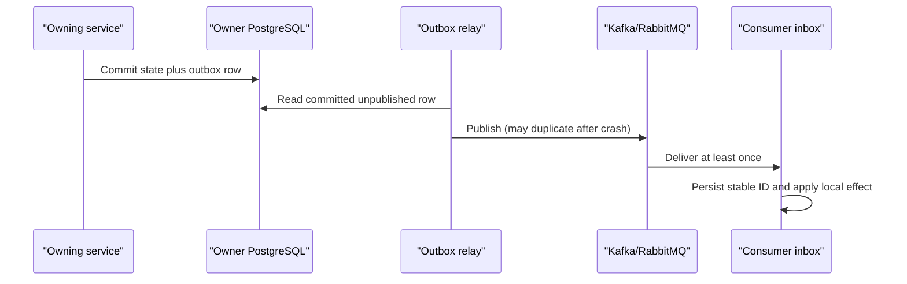

# Data ownership and consistency

Status: Canonical
Last validated: 2026-08-01

This document defines the target data contract for BidPoint. It is design guidance for a future implementation in this documentation-only repository; it does not describe deployed databases or running consumers.

## Ownership is the write boundary

Each business module or service is the only writer of the data it owns. Ownership includes the schema, migration history, validation of authoritative state transitions, outbox records, and the audit evidence necessary to recover an interrupted operation. No consumer obtains authority merely by storing a projection of another owner's facts.

| Owner | Authoritative data | May expose | Must not write directly |
| --- | --- | --- | --- |
| `core-platform` / `profiles` | Marketplace profile keyed by Keycloak subject | Profile behavior and facts | Credentials or Keycloak data |
| `core-platform` / `catalog`, `listings`, `auctions`, `orders` | Their respective category, listing, lifecycle, and order records | APIs and producer-owned facts | Bid or payment state |
| `bidding-service` | Bids, current price/winner, idempotency state, auction-state projection including `closeAt`/lifecycle version, and fence acknowledgements/final outcomes | Bid facts and command results | Core auction tables or orders |
| `payment-service` | Payment intents, provider references, webhook/replay records, payment audit | Payment facts | Order records or card data |
| `notification-service` | Notification intent, policy decision, PostgreSQL job outbox | Explicit RabbitMQ work requests | Provider delivery attempts |
| `notification-worker` | Delivery attempts and idempotency evidence | Delivery outcomes and DLQ evidence | Notification policy or intent authority |

Core may initially use one PostgreSQL deployment and database operationally. That convenience does not create a shared model: every Core module owns a logical schema, has a single writer, and communicates through exported behavior or events. There are no cross-module schema joins or writes as an integration technique. Every extracted service owns its own database/schema and migration history; no cross-service database joins or writes are allowed.

## Read and transaction rules

Cross-owner reads use an owner API when a current answer is necessary, or a local projection when bounded staleness is acceptable. A projection is query acceleration, not permission to make a foreign state transition. PostgreSQL remains authoritative state; Redis is ephemeral acceleration/coordination, S3 is object storage, and **Staged** OpenSearch is a derived search store.

Transactions stop at a local database boundary. A command never opens a distributed transaction spanning `core-platform`, `bidding-service`, `payment-service`, or another owner. Instead, the owner commits its state and an outbox record in one local transaction; later publication and consumer processing advance the cross-owner flow. The client sees an explicit processing state where the outcome cannot yet be known.

| Interaction | Required consistency | Recovery posture |
| --- | --- | --- |
| Accept a bid | Immediate local invariant enforcement | Same idempotency key resolves ambiguous timeout |
| Create a payment/provider action | One logical intent and no duplicate charge | Reconcile provider state before a new action |
| Create an order from auctions-owned `AuctionClosed` after `CLOSED` | One logical order despite redelivery | Event/auction deduplication; bidding outcome cannot trigger |
| Search, notification view, SSE | Eventual consistency is allowed | Expose lag; refetch authoritative state when needed |

Search results, notification views, and live streams may lag. Accepting an invalid bid and charging twice may not. This distinction determines whether a decision belongs at an owner write boundary or can be computed asynchronously.

## Outbox, inbox, and delivery semantics

An owner writes a business state change and its event/job outbox row atomically. A relay reads committed unpublished rows and publishes them later, marking publication safely enough to survive relay crash, retry, or duplicate publish. A crash after business commit therefore creates recoverable backlog instead of a lost fact.

Delivery is at least once. BidPoint does not claim end-to-end exactly-once delivery. Every Kafka/RabbitMQ consumer records a stable message identifier in an inbox/deduplication table, or provides an equivalent durable stable-ID mechanism, before repeating a side effect. Consumer state transitions and deduplication evidence are committed atomically where their local store permits. An externally visible provider side effect additionally requires stable-key provider idempotency and reconciliation. An ambiguous provider call is `UNKNOWN` and quarantined without automatic replay until reconciliation establishes whether the side effect occurred.

Retries are explicitly classified retryable, terminal, or provider-ambiguous as applicable, use bounded exponential backoff with jitter, and surface backlog/attempt evidence. A poison event/job eventually reaches a DLQ or quarantine path with its identifiers and error context. Replay preserves the stable identity; external provider work follows its idempotency and reconciliation contract, with `UNKNOWN` notification attempts quarantined rather than automatically replayed.

## Bidding concurrency contract

`bidding-service` owns one authoritative current price and at most one current winner for an `auctionId`. Its local auction-state projection stores Core's authoritative `closeAt` and monotonically increasing `lifecycleVersion`. Acceptance checks projected eligibility, minimum increment, bidder rules, and idempotency at the authoritative write boundary, and trusted server/database time rejects every request at or after `closeAt`; client time is ignored. Projection lag while opening may cause a conservative rejection, but lag while closing or cancelling may never permit acceptance.

Core `auctions` commits `CLOSING` and sends an idempotent Bidding REST fence/finalize command. Bidding serializes it with bid transactions and returns a stable acknowledgement/final outcome; this is not an order trigger. After close acknowledgement, `auctions` atomically commits `CLOSED` and one stable producer-owned `AuctionClosed` through Spring Modulith durable event publication. It carries winner/no-winner, final price, and lifecycle version. Cancellation commits `CANCELLED` without an order trigger.

The exact choice between optimistic locking, pessimistic locking, and an atomic database operation is a **Staged implementation choice**, not a discovery-level Open architectural question. Measurement selects it during bidding implementation. Load and concurrency tests must prove the invariant, characterize hot records, and show how conflict handling behaves. Auction facts are partitioned by `auctionId` for per-auction event order. This can make a popular auction a hot Kafka partition, so load tests and mitigations are required rather than assuming partitioning solves capacity.

## Failure-aware flow ownership

For close, `auctions` owns `CLOSING`, `CLOSED`, and the single authoritative `AuctionClosed` order trigger. Bidding owns the fence acknowledgement/final bid outcome, but its outcome is audit/projection input only. `orders` consumes `AuctionClosed` after commit and creates at most one order through event/auction deduplication. The same fact may be externalized to Kafka with the same identity. Other owners retain their payment and notification responsibilities.
