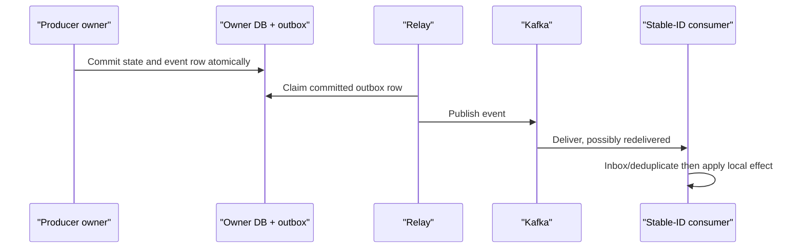

# Kafka events and transactional outbox

Status: Canonical
Last validated: 2026-08-01

Kafka transports BidPoint's durable, replayable business facts. This target design intentionally separates the committed state change from eventual publication without pretending the combined system has end-to-end exactly-once delivery.

## Facts, producers, and consumers

An event reports something that an authoritative owner has committed. It is not a remote command, a generic integration dump, or permission for consumers to edit the producer's data. Core modules publish producer-owned external contracts from `contracts/events/`; surrounding services own their own contracts and databases. `api/events/` in Core is separately named for Spring Modulith internal events and must not be confused with the Kafka wire contract.

| Producer | Representative facts | Consumers/use |
| --- | --- | --- |
| `core-platform` modules | `profiles.UserRegistered`; listing/lifecycle facts; auctions-owned `AuctionClosed` committed atomically with `CLOSED`; order facts | `orders` after-commit handling, notification policy, bidding projection, realtime, **Staged** search |
| `bidding-service` | Bid accepted/rejected outcomes and final bid outcome | Audit/projections, realtime, notification policy; never order creation |
| `payment-service` | Payment state/finalization facts | Orders/history views, notification policy, realtime where useful |

`search-service` is **Staged** and consumes listing facts to build an OpenSearch-derived store. Search does not become an authority and initial browse/filter remains owned by Core. Kafka/MSK operating mode and schema registry are **Open**; this document does not select either.

## Envelope and compatibility

Every external fact carries an envelope with at least:

| Field | Purpose |
| --- | --- |
| `eventId` | Stable producer-assigned identifier for deduplication/replay |
| event type and version | Explicit semantic and wire evolution |
| aggregate ID | Owner aggregate, including `auctionId` for auction facts |
| occurred-at time | When the owner committed the business transition |
| producer | Traceable authority that emitted it |
| correlation ID and causation ID | Follow one operation and its triggering fact |
| trace context where appropriate | Continue observable traces across async boundary |
| payload | Minimal producer-owned business fact, not private persistence model |

Consumers treat unknown versions and invalid payloads as explicit compatibility/operational conditions rather than deserializing private models. Contract changes require version-aware consumer rollout and replay evidence. Stable `eventId` is retained through retry/DLQ handling; a replay does not create a new logical event identity.

## Transactional outbox

Within a producer's local PostgreSQL transaction, authoritative business state and a durable outbox row commit together. The outbox contains the envelope, destination/topic metadata, stable event ID, and publication state necessary for a relay to resume. A separate relay publishes committed rows later and safely retries when Kafka is unavailable. If it crashes after send but before recording publication, duplicate publication is possible and expected; consumers must deduplicate.

Backlog age, unpublished rows, relay errors, consumer lag, retry count, and DLQ/quarantine count are operating signals. They make a partial failure visible instead of accepting a lost event or declaring synchronous completion. Kafka gives durable facts and replay capability, not a distributed transaction with every consumer.

## Ordering and consumer safety

Auction facts are partitioned by `auctionId` to retain per-auction Kafka order. There is no global marketplace order, and producers/consumers still defend against duplicates and stale projection conditions. A popular auction can become a hot partition even as this partition key preserves correctness. Load tests must measure partition skew and lag, then justify mitigations without breaking the per-auction ordering requirement.

Each consumer uses a durable inbox/deduplication table or equivalent stable-ID processing. It records enough information to make local effects idempotent, including effects that create a Core order, an SSE projection update, a notification intent, or a payment-related projection. Bounded exponential retries with jitter apply only to classified retryable failures. A poison event reaches a DLQ/quarantine path with event ID, owner, correlation/causation, error, and attempt history. Replay procedures start from a defined offset/scope, preserve event identity, and do not repeat a charge, email, or other externally visible side effect.

## Flow examples

- A bid command commits in `bidding-service` with bid state and a bid outbox row. Kafka delivery may update realtime, notification, and audit projections, but cannot trigger an order.
- Close correctness does not wait for Kafka lag: after the stable Bidding acknowledgement/final outcome (not an order trigger), `auctions` atomically commits `CLOSED` and one producer-owned `AuctionClosed` through the durable Spring Modulith event-publication/outbox mechanism. `orders` consumes only that fact after commit and deduplicates by event/auction identity. The same `AuctionClosed` may be externalized to Kafka with the same identity.
- `payment-service` commits verified webhook application with payment state and a payment outbox fact. Replayed webhooks and repeated events resolve through stable provider/event identifiers, never a second charge.
- `UserRegistered` is a producer-owned `profiles` application fact emitted after verified Keycloak identity evidence activates the marketplace profile idempotently. It is not a Keycloak credential-creation event. `notification-service` consumes it, decides a welcome email is required, and starts its own local intent/job-outbox transaction; RabbitMQ delivery is a subsequent work flow, not a Kafka consumer side effect without recovery evidence.

**Excluded:** Spring Cloud Stream as the baseline abstraction. At-least-once processing, explicit envelopes, local outboxes, durable deduplication, controlled retries, and replay drills are the learning contract.
